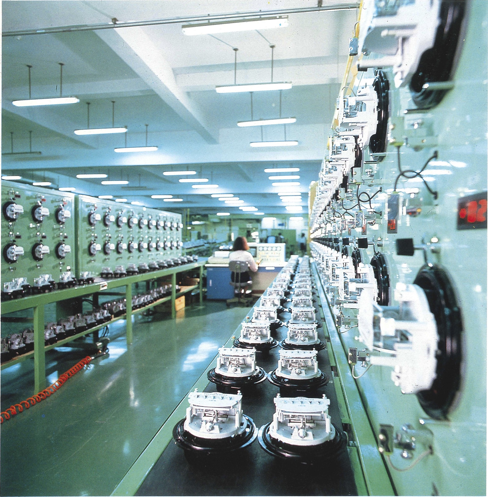
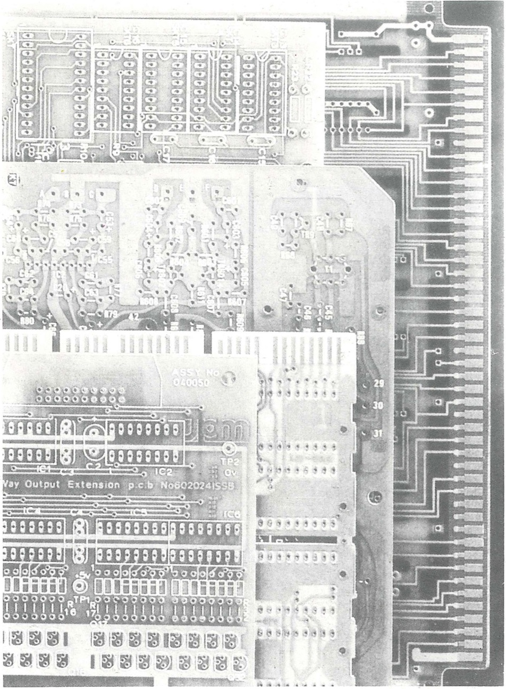
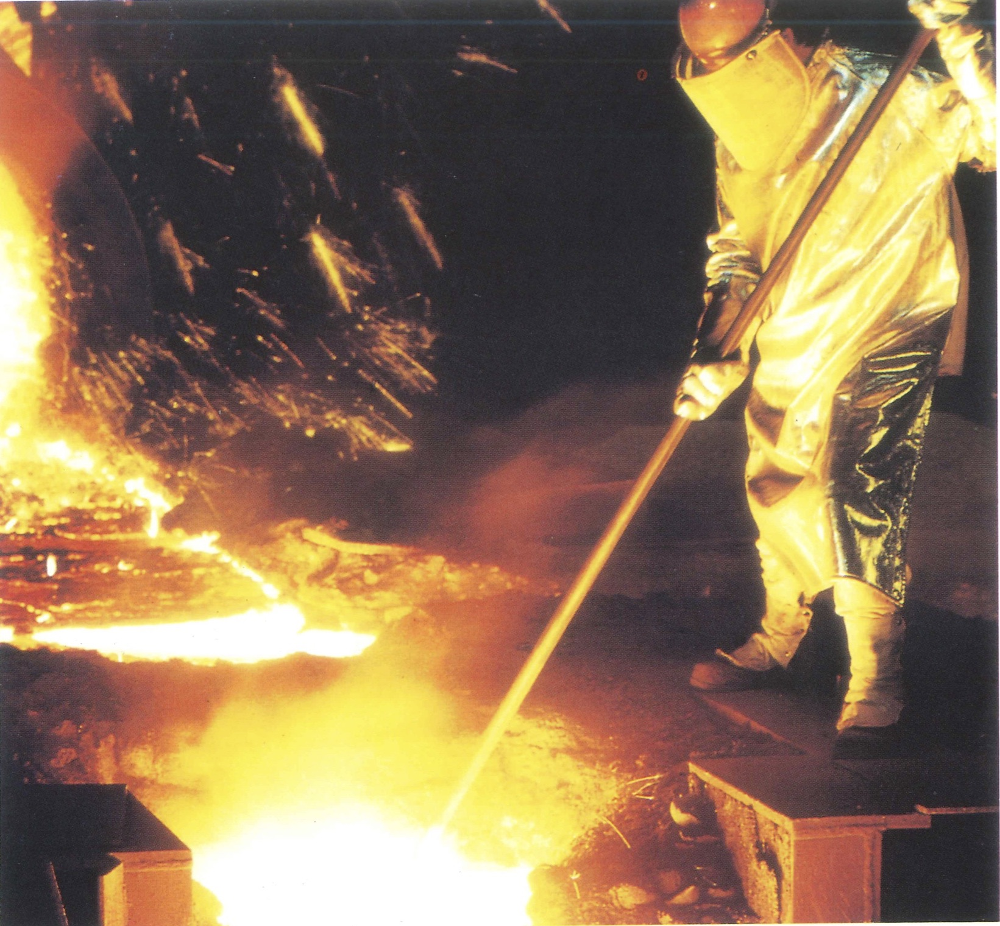
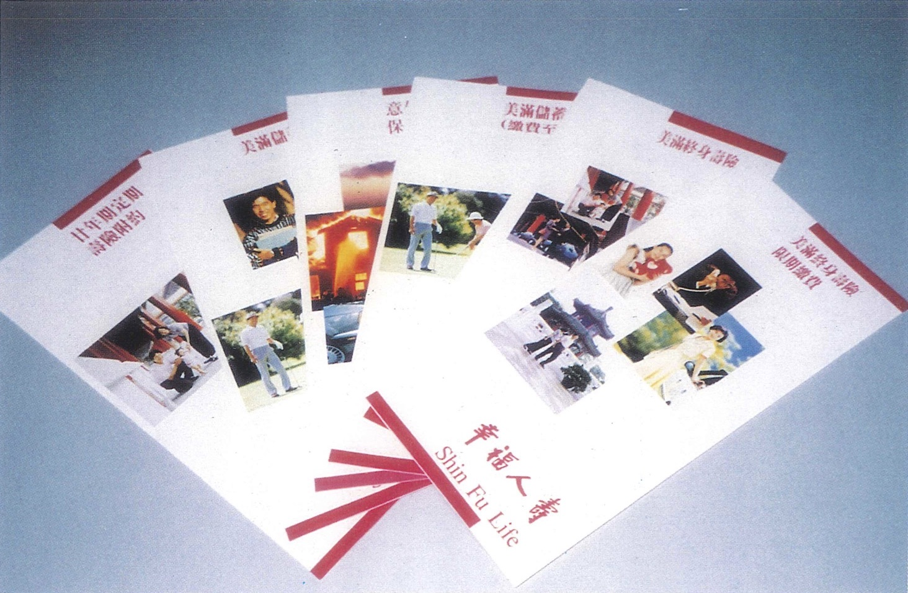

# 序言

中國國民黨創辦黨營事業，源起於民國三十四年本黨第六屆全國代表大會，黨中央依循會議所訂定的財務基本方針，以事業盈餘充作黨務經費，在當時黨營事業粗具規模。迨政府遷台，本黨經濟事業只有齊魯公司在台復業，經過四十餘來的辛苦經營，黨營事業隨著台灣的經濟發展，規模逐渐壯大，對台灣經濟發展有不可磨滅的貢獻。

本黨投資經營事業，有以下四個基本使命：

### 一、配合國家產業政策，開創投資領域，推動經濟繁榮。

台灣的經濟奇蹟，是奠基在本黨長期執政所倡導的總體經濟政策與產業發展政策，而每當政府推動產業政策力有未逮時，便由本黨創辦的黨營事業率先配合，進而帶動經濟成長。譬如民國五〇年代的進口替代工業、六〇年代的石化業、七〇年代的金融事業，皆可看到黨營經濟事業的貢獻。

### 二、以企業利潤支應黨務經費，兼顧黨員福祉，以凝聚同志之向心力。

本黨的財源來自黨員所繳之黨費、政黨捐獻及黨營事業之盈餘等項。其中黨費及政黨捐獻變數較大，只有黨營事業盈餘之解繳較能掌握，因此本黨的預算開支，絶大部分來自黨營事業盈餘之分配。此外，黨營事業亦對黨員同志提供優惠的產品或服務，以照顧黨員福祉。

### 三、為股東創造最高之企業價値，並兼顧社會公益、社會責任。

黨營事業追求的目標是兼顧社會公益與企業利益，因此在各行業所創辦的事業，不但恪遵政府法規，而且須以民衆及社會利益為考量，結果除了股東得到合理報酬，許多事業也成為各行業有口皆碑的楷模。

### 四、建立專業化、國際化及正派經營之企業形象。

李主席在八十二年黨營事業業務研討會中曾剴切昭示，本黨事業在面對社會多元化及各界人士的期許下，務必朝財務公開化、管理效率化、經營國際化、形象清新化、產品卓越化及成果大衆化六個方向發展，就是要將黨營事業形象再塑造，成為新時代的經濟尖兵。

適值中國國民黨建黨百週年之際，將本黨經濟事業的發展歷程與對社會、經濟的貢獻編印成書，一方面可留作見證，另方面亦希望接受社會各界人士的指教，使本黨黨營事業如同對國家經濟發展的貢獻一樣，在政黨政治的發展中，亦能建立新的里程碑。

中國國民黨中央委員會秘書長 許水德

==========

# 序言

中國國民黨黨營經濟事業於民國三十八年在台復業，即以配合國家建設、擴大為民服務、支援黨務經費為宗旨，歷經四十多年的辛勤耕耘，其間，黨營經濟事業配合台灣經濟發展的歷程，走過從前，完成階段性的任務，並隨著大環境的變遷，調整經營策略，邁向未來，這些事蹟大部分是外界所不瞭解甚或誤解的。本刊出版的目的，是希望把黨營經濟事業的過去、現在與未來的發展，透過淺顯的文字，介紹給國人認識。

本刊内容將黨營經濟事業在台灣的發展分為五個階段。在民國四〇年代為初創期，僅有齊魯企業在台復業、裕台公司推展貿易。在民國五〇年代為奠基期，此時配合政府經建計劃，發展建台水泥、接辨景德製藥、開創中興電工、成立台灣建業。在民國六〇年代為拓展期，成立中央、光華二大控股公司，開始在各種產業進行全面性的投資，尤其是響應政府發展石化工業的政策，投資東聯化學、中美和石油化學、永嘉化學及台灣苯乙烯；並為協助政府創設貨幣市場，又成立中興票券。在民國七〇年代為轉型期，此時中央產保開始飛躍成長；復華證券金融公司當初為配合政策於民國六十九年成立，經過八年慘澹經營，於七十七年開始逐步轉虧為盈；中華開發在此時期亦有結構性改變，除了傳統的投資業務外，亦全面發展授信及投資銀行業務；此外，為因應社會需要，成立衛豐保全，以及為協助政府推動B型肝炎防治需要，投資保生製藥；另又成立啓聖實業，投資營建事業•，同時光華公司亦成立能源事業部，整合全省導管瓦斯公司。

到了八〇年代，為黨營事業的擴張期，在環保方面，有衛宇環保、衛宇科技及清宇環保。在營建方面有灃水營造、漢谷開發顧問、昭凌工程顧問、大通建築經理及興業、永昌和漢洋等建設公司，從顧問設計到營建管理，形成營建業的垂直整合◦在金融證券方面，成立大華證券和華信銀行，皆為各該行業的佼佼者。在人壽保險方面，成立幸福人壽，服務黨員及民衆。八〇年代最重要的發展，是黨營事業配合政府推動區域經濟合作及成立亞太營運中心的政策，近年來開始在無時差經濟地區進行投資，由悦昇昌主導負責，在日本成立台灣貿易株式會社，對越南、印尼、菲律賓進行基本建設事業的投資，將來尚要在東北亞、南非及大洋洲發展貿易與投資。各控股公司亦與歐美、日本、以色列等著名企業集團策略聯盟，以協助國内企業技術升級。中華開發亦率先在新加坡設立基金，加強對中南半島的投資。

近年來在内部管理方面，推動企業化經營、聘請專業總經理、強化董事會決策功能、建立事業稽核制度、加速所屬事業上市上櫃等，皆已積極進行。另外認真執行黨營事業集團内的策略聯盟，以擴大經濟規模與綜效，亦已見具體成果。最近又捐贈基金籌設醫院、老人安養中心，興建每坪六萬元平價住宅，積極辦理回饋社會的工作。總之，黨營事業的使命是在配合政府政策及善盡社會責任的前提下，為股東中國國民黨爭取合理投資報酬，以支援黨務所需之經費。本書之編纂，説明黨營經濟事業之發展歷程，文化事業部分另刊記载，就是要讓全體黨員同志及民衆暸解，中國國民黨黨營事業已建立良好規模與制度，必能完成所交付的使命，實現本黨政治理念。

中國國民黨黨營事業管理委員會主任委員 劉泰英

==========

# 歷任黨營事業負責人專訪

==========

## 俞國華先生──辛勤耕耘，必歡笑收割

六〇年代是中國國民黨黨營事業發展史上，一個具代表性的里程碑──黨營事業開始朝企業化經營方向起步，那個時期創設多家黨營事業，為奠定日後黨營事業發展的重要播種期。

在這年代裏，現任總統府資政、當時的中央銀行總裁俞國華先生，身繋管理黨營事業的掌舵工作，灌輸黨營事業負責人要有企業化觀念，並且協助興辦多家黨營事業，不但使黨營事業的觸角延伸，為經濟發展貢獻一份力量，更在社會上扮演舉足輕重角色。

### 倡議企業化理念

俞國華先生在國民黨中，曾擔任過兩個階段重要職務，首先是自民國五十九年六月至六十一年五月，出任國民黨文化經濟管理委員會主任委員。後因黨營文化事業獨立，文經會歸併於財務委員會，由俞國華先生擔任財委會主委，繼續掌理黨營經濟事業管理工作，直到六十八年十二月，他出任國民黨中央委員會常務委員後，依規定辭去這方面的黨職。

俞國華先生回憶當時黨營事業發展及管理情況時表示，早期文經會負責管理黨營事業，但因缺乏經費，無法積極擴展，尤其文化事業，大部分都呈虧損狀況。他說，六〇年代的黨營事業，缺乏企業化經營的觀念，自認它是為黨宣傳或工作，若黨營事業經營有虧損，黨應伸出援手，予以補貼。他當時即對黨營文化事業的負責人說：「你們要設法多作廣吿，增加收入。」，他也倡議黨營事業應有企業化的理念。

回顧六〇年代黨營事業的發展及沿革，俞國華先生接掌國民黨財務委員會時期，財委會旗下的黨營事業，大多是些陳舊、規模不大的公司，其中較具規模的只有齊魯、裕台及建業等幾家公司而已，及其所屬的一些生產事業。兪資政回憶說：「那時的財委會沒有資金，因此黨營事業常收買行將倒閉或虧本的公司，以為加以整頓，可成為一個全新的事業。」但後來發現，這些公司因組織人事都不健全，難以整頓，能起死回生者為數甚少。

俞國華資政在擔任財委會主委後，開始推動石化工業投資計畫，當時中油公司董事長胡新南是財委會的副主委，兩人聯合提倡石化業的投資，先後創辦了中美和、東聯、台苯及永嘉等多家公司，由財委會、中油公司和其他民間公司共同投資，由於當時國內只有生產石化原料，中間產品均須仰賴國外進口，黨營事業和中油公司等率先投資這幾家公司，供給中間石化原料，對日後我國經濟發展，甚有幫助。

### 推動建立金融市場

其次關於金融業方面，最早於民國四十八年籌備投資成立中華開發信託公司，以投資與融資方式，扶植國內產業的發展。由俞國華先生負責籌備，當時他任中央信託局局長，張心洽先生為其副手，籌備成立後，聘金融界先進霍寶樹先生擔任中華開發信託公司首任總經理，張心洽先生為副總經理。由於中國銀行（中國國際商業銀行的前身）投資中華開發，兪資政也被選邀出任中華開發常務董事，一直到出任財務部長，才辭去這個職務。

在沒有票券市場的時期，國內工商業籌措短期資金甚為不便，所以，財委會在六〇年代中，乃創辦第二個金融事業，即是中興票券金融公司。當時財委會的動機是為配合政府的施政，推動建立票券市場，最初計畫擬先成立三家票券金融公司，爾後再行擴大，以協助工商企業在貨幣市場籌措所需的短期資金。

談到票券市場的建立，俞國華先生提到，當時政府認為：要建立健全的票券市場，必需由信用可靠的財團來出面主持，於是俞國華資政邀集銀行業共同投資成立票券金融公司，以確保票券業日後之正常發展，不致有脫軌、失序等情事，中興票券乃得台銀、土銀等共同投資成立，並請張兹闓先生出任董事長，使票券市場得以正常發展。

第三個成立的金融機構為復華證券金融公司，專門承作股票融資及融券業務，當時證券市場祇有融資，而缺少融券，成為跛足的情形，政府為補救這一缺點，想辦一個融資融券的機構，所以財委會為配合政府決策，聯合多家金融機構籌設了復華証券金融公司，使得一般人可以融資及融券。復華証券金融公司將投資人融資時所提供的股票抵押品，作為對客戶融券的籌碼來源。

復華証券金融公司成立初期有些虧損，其所獲得盈餘尙不及銀行利息的優厚，連續虧損了四年，後來開辦融券業務，復華証券金融公司才開始獲利，而外界的眼紅及批評也就接踵而至，認為黨營事業獲取暴利，其實，當初復華証券金融公司是為配合政府推動政策而才成立的，所以俞國華先生才說：今天黨營事業的成就，實由於早日的播種。

### 創設控股公司

過去黨營事業都是借用黨員以個人名義，代表黨出面登記，所以俞國華先生開始成立控股公司，把私人名義下的黨營事業全部交給這些控股公司，以民營公司的型態來營運，這樣一來黨營事業開始逐步走上企業化。俞國華先生還將過去的傳統性工業加以現代化，提高其生產品質，這也是當時黨營事業發展的方向之一。

總結而言，黨營事業對於台灣經濟的發展，實在有很多貢獻，有人認為黨營事業是特權產物，但兪資政強調所有黨營事業都是以民營企業方式來經營，一切依法營運，並無利用任何特權，倒是黨營事業為了配合政府的政策，與菌營、民營事業共同投資，提倡新的事業，使政府許多政策得以推動。在國家百廢待舉的艱辛起步階段，黨營事業義無反顧地挑起富國利民的責任，這個事實是不容抹煞的。

==========

## 鍾時益先生──健全財務，功在黨國

六〇年代末期，本黨持股在五〇％以上的黨營直屬經濟事業只有十家，行業包括金融、保險、製藥、水泥、電機、電子、造紙、鋼鐵等，規模都屬中小企業。

現任總統府國策顧問鍾時益先生，曾任國防部主計局長、六十七年轉任行政院主計長，於六十八年十二月兼任中國國民黨中央財務委員會主任委員，黨營事業在他的領導下，經過八年半的努力，事業盈餘增加二十五倍多。事業經營效益增加的原因，在於擴大經營規模，如中興票券分公司由原有一家增為四家，中央產保分公司由一家增為三家，以擴大業務。齊魯公司南勢角工廠遷至新竹北埔，中興電工公司中和工廠遷至林口，舊廠土地再利用增加不少經濟效益。此外，鼓勵硏究發展，亦為經營效益增加的原因之一。

### 建立投資管理制度

鍾主委在其任內重要興革之一，是將中央、光華兩投資公司之運作實質化。民國七〇年代，鍾主委有鑒於控股公司必須因應環境變遷及實際需要，便設置專職人員，擔負起營運責任，並聘請專業經理人殷文俊先生專任中央投資公司總經理，充實專職人員，建立投資管理制度。

由於兩大投資公司投資項目日漸增加，且產業類別繁多，為增進運作效率，隨後又陸續創立建華、啓聖兩家投資公司，以使黨營事業股權回歸本黨。

鍾主委為改進事業管理績效，特延聘學者、專家、財委會業務主管及部分事業主持人，共同組成推行委員會，負責推動「本黨經濟事業管理改進方案」，其成效有：

第一期計畫（七十至七十二年）：完成長期發展目標之硏究和整體經營系統硏究，辦理組織員額評鑑，舉辦高、中層主管訓練與業務座談，及率同各事業主持人組團考察民營企業等。

第二期計畫（七十三年至七十五年）：輔導各事業完成六年經營發展計畫，健全人事管理制度、調整薪資結構，推行品管圈活動、改進生產與行銷管理，修訂會計制度、建立管理資訊系統、增進營運效能、硏究新投資機會、創辦新事業及辦理幹部訓練、培育人才、適應事業之發展等。

第三期計畫（七十六至七十八年）：強化各事業六年計畫，規劃前瞻性、開創性、中長程經營目標，硏究修訂管理規章、提高管理效率，加強硏究發展、拓展經營規模、投資新事業，擴大整體資訊電腦作業系統、硏訂長期投資會計，繼續辦理業務硏討與幹部訓練等。

### 奉獻國家，服務人民

中國國民黨投資經營事業，除了要籌措黨務經費外，還肩負配合國家經濟發展與發揚服務精神的兩項任務。六〇年代以後，政府為發展國家經濟，常要從工業先進國家引進新觀念、新技術。尤其是高科技產業投資大、風險高，往往不易在民間覓得合作伙伴，在此種情形下，本黨莫不毅然率先響應，參與石化工業、電子工業、租賃、票券金融、證券金融、大汽車廠等投資。

隨著國家經濟快速發展，早期投資的事業，多半需要經營若干年後才有盈餘，這當然要拜「台灣經濟奇蹟」之賜，至於投資失敗血本無歸的例子，也是常有的事。然而近幾年來若干有心人士卻惡意汚衊本黨利用特權，實在有失公平。

鍾主委任內為配合國家經濟發展，所投資的事業計有台灣積體電路、安鋒鋼鐵、欣欣水泥、中加投資、環宇投資、台港貿易、大華證券、大通建築經理及台北世貿中心國際大樓等二十六家公司，目前經營狀況大致良好。

本黨經營事業另外一個目的，就是為民服務以善盡社會責任。對早年創設的景德製藥公司，在鍾先生任內，投入鉅額資金，興建新廠房，引進新技術，實施GMP制度，增加產能，提高品質。此外投資永進生物科技公司、保生製藥公司，為增進國民健康貢獻心力。

此外，為提高國民生活品質，與行政院國軍退除役官兵輔導委員會合作投資欣高、欣雄、欣泰等七家石油氣公司，以導管代替桶裝供應用戶，民衆稱便。民國六十八年至七十六年期間，國內外經濟與投資環境變化甚大，黨營經濟事業之經營管理，在鍾時益先生主導之下，投資新事業多達三十七家，成績斐然，但他總是勉勵同仁，信守「事在人為」的箴言，不斷革新創造，悉力以赴。

### 不斷革新，事在人為

綜觀鍾時益先生一生對黨國貢獻良多，在國防部主計局長任內，引進最新科學方法，諸如績效預算，設計計畫預算等制度；在行政院主計長任內，對國家預算、會計、統計制度之改進與健全，功不可沒。在兼任中國國民黨中央財務委員會主任委員任內，對本黨財務之支配，黨務基金之籌集運用，整理黨有財產，尤其在整頓、發展黨營事業，以充裕黨務經費，不遺餘力，建樹良多。因此，民國七十七年八月鍾主委卸任時，中央委員會特頒授實踐一等獎章，以嘉勉其對黨的卓越貢獻。

（編註：鍾時益先生因身體不適，無法接受訪問，改請財委會三位前副主委李增榮、姚正中、王炳南三位先生口述鍾先生當年的事蹟，並由前秘書佘憲光先生負責整理）。

## 徐立德先生──為國為黨，全力以赴

近年來，隨著中國國民黨黨營事業財務及營運的公開化、透明化，過去讓外界感覺莫測高深的黨營事業其「神祕面紗」已逐漸揭去，也使得當今黨營事業發展動向，愈形受到社會各界矚目及重視。民國七〇、八〇年代的黨營事業，在快速擴充、發展後一一崛起，並被視為國內市場的重要競爭對手。

黨營事業對國家、社會、經濟有何貢獻？現任行政院副院長徐立德說：「國家需要它的時候，民間不願意做的事，黨營事業來做，扛起責任，是黨營事業最大的貢獻。」

### 奠定黨的財務基礎

徐立德先生過去曾擔任國民黨財務管理工作，於民國七十七年七月三十一日到八十二年一月三十一日，任職財務委員會主任委員。他認為，這段時期國民黨正處於民主化的重要轉型階段，當時黨的財務工作，最主要任務是促使黨的財務自給自足，奠定黨的財務發展基礎。在國民黨民主化發展下，必須遵循黨政分際原則，也就是說黨營事業應開始負擔起黨的財務責任，他強調，這是一個很重要的關鍵。

很多人不太瞭解黨營事業，徐立德副院長向社會坦承，由於國民黨是創建中華民國的政黨，早期政府遷台，僅齊魯公司一家在台復業，而當時觀念裏，黨和國是一體的，因為黨所有的工作都是替國家做事，所以黨的領導人從來沒有想到要置產，也沒有黨要經營事業的觀念。國家需要黨時，黨就擔負起它的責任。隨著國家的需要、配合政策，黨營事業即是在這種情況下產生。

因此，早期國民黨除了齊魯公司外，可說是沒有黨營事業，其後成立的黨營事業，則是為了配合政府政策需要而設立，例如復華証券金融公司，當初是為提供證券市場融資及融券功能而設立；或者為了協助瀕臨倒閉的企業，由黨介入參與經營，例如東聯化學等公司的產生，是因其本身經營不下去，黨去協助這些快倒閉的企業。

又如中國國際商業銀行，當初之所以移轉給黨來接手，就是為了應付當時政府退出聯合國變局考量。「國家需要黨時，黨就出來做民間不要做的事，為國家負起責任，是黨營事業最大貢獻之處。」徐立德副院長歸納黨營事業的發展歷程後如此說。他指出，當今社會之所以會批評國民黨黨營事業，是因將黨營事業與公營事業同等看待，這種看法不盡正確。嚴格來說，黨營事業應屬民營企業，國民黨並沒有百分之百持股的黨營事業，完全配合民間共同參與投資。黨是以投資者身分，須依據法令，以企業的方式來經營，為創造企業財富並分享社會大衆的目標而努力，因此並無特權問題。

外界認為執政黨黨營事業組織太龐大，運用特權與民爭利，除副院長反駁說，外界不瞭解執政黨在這些黨營事業中，究竟占有多少股份，能從中獲取多少利潤。有人說國民黨黨產多達六千億元，是經人渲染、膨脹的結果，其實並不然。因為，黨的投資在許多公司中所佔的的股份極小，更何況公司的資產還要減去負債才是公司淨値。

他認為，四十年來，許多政府不能做、民間不願做的事，都由執政黨承擔下來，執政黨做了太多原本是政府應做的事情。如今時代變遷，執政黨則應該考慮把這些工作及人員還給政府，以做到黨政分際。徐立德副院長對黨營事業經營原則，認為對優良的黨營事業，積極輔導其股票上市；經營欠佳的事業，應加強其管理績效，並協助其董監事會改善經營策略，或輔導其調整財務結構；至於虧損的事業，則加以整頓合併。

回憶民國七〇年代過渡到八〇年代的黨營事業發展情況，徐立德副院長表示，那個時期黨的事業積極拓展，增加許多新興的黨營事業，並且朝企業化方向發展，經營方式如同民間企業，財務公開化、透明化，並延攬專業人才來經營，整頓黨的財產，將黨營事業當作「企業複合體」加以經營，徐副院長說：「這個時期黨營事業加速擴張，並且對外辦理股票上市、公開募集等，黨營事業如今所處階段，是一個真正轉捩點。」

### 講求經營效率與紀律

談及黨營事業經營最主要的目標，徐副院長認為，黨營事業應該有民營事業的「效率」，同時具有公營事業的「紀律」。民營企業經營優點雖是較具有彈性，講求效率，能隨著市場機能來變化，但民營企業往往會較缺乏紀律，只圖私利，什麼事情都可以做；但黨投資的事業不能這樣做，它要遵守國家法令，受到社會上的監督、它必須經營有利於國計民生的事業，所以黨營事業今天逐漸朝向環保、公益的事業方向發展。黨營事業是民營事業，如今民營事業對國家有沒有貢獻？答案當然是有貢獻，黨營事業以投資者身分，來創造財富、分享社會大衆，進而股票上市，都是黨營事業對國家、社會的貢獻。

在徐立德副院長擔任國民黨財務委員會主任委員期間，將近四年半的時間裏，黨營事業增加投資了四十多家公司，長期股權投資金額增加二百多億元，資產淨値增加一百五十億元，充分反映此時期黨營事業的快速擴充、發展。「我認為今天黨營事業確定了其發展方向，就是希望黨營事業能將公益及私利結合一起，將企業家追求利益的目標，與社會大衆利益結合在一起，同時也不忘追求公共利益。」徐副院長認為，這是黨營事業發展迄今最重要的一個觀念。

其次，是希望將黨營事業與一般民營事業一樣，「把黨營事業的招牌掛出去」，也就是將黨營事業財務報表公開，不要再像過去躱躱閃閃，連一個資產負債表都不敢拿出來，而改以財務透明化作法，將黨營事業真正推到社會上去，如今可以申請上市，也可以出售黨的持股，以一般企業的方式來經營。將黨營事業當作一般民營事業來辦，是黨營事業今日很重要的一個作法。

徐立德副院長指出，黨營事業過去並未被社會重視、矚目，外界認為是腐敗、缺乏效率的企業。但如今國內各大傳播媒體以頭條或醒目地報導黨營事業有關新聞，甚至連華爾街日報都大幅報導，顯示黨營事業已逐漸變成市場中重要的競爭力量，開始受到社會的注意，更被社會刮目相看，認為黨營事業已成為一個具競爭力的企業體。另外，黨營事業也開始有新的經營管理人才出現，而黨營事業的各路人馬，也是社會矚目、重視的焦點人物，此也是徐副院長頗引以為傲的事。

### 引進人才創新觀念

徐副院長憶及當初接掌財委會管理黨營事業時，大家並未將黨營事業當成事業來辦，他發現有許多忠誠、保守的幹部，默默地做事，絕對不向外張揚，好像把黨營事業包上一個「外殼」，極力不讓外界觸碰。這些幹部上班時，還以袖套套著西裝袖子，完全是傳統公務員的保守心態及作風，也將黨營事業與外界完全隔離。他個人對這些忠誠的幹部表示相當崇敬之意，他們為黨犧牲奉獻，不求個人聞達，但是他同時質疑：黨營事業如此下去，還能建立事業嗎？所以執政黨必須引進新的人才。

因此，他在財委會主委任內，積極引進新的黨營事業人才，希望黨營事業能有長足進步與發展，但他也感到在黨營事業發展新舊交替時期，一方面須引進新人才開創事業，另一方面卻須加強新舊經營者間的雙向溝通，彼此融合、包容，共同接受新的觀念。「在保守中有前進，在前進中要保守」，進進退退之間，為黨營事業的前景鋪路，提倡新觀念，並從黨營事業開始慢慢散佈出去。

近幾年，執政黨提倡金融事業發展，例如投資大華證券公司等，促使證券市場的發展，是黨營事業率先提倡，若沒有黨營事業，怎麼會有新的資本市場或投資銀行的業務。許多觀念是從黨營事業慢慢開始的，他以經濟部所屬事業中國鋼鐵公司為例，說明中鋼早期推動民營化公開承銷作業，即是由黨營事業環宇投資公司協助開創、規劃的結果，後由中華開發信託公司負責公開承銷。

徐副院長曾在財委會任內發一豪語，他說：「我要在政治學中寫一篇專章，闡述政黨籌集資金，以經營黨營事業為最佳途徑」。他表示，有很多人認為政黨不應經營黨營事業，這個觀念是不對的，現今政治學對政黨如何籌募資金，有很多不同的看法及意見，其不外乎黨費、公開募捐等方式，但卻無任何論點認為興辦黨營事業是不對的，例如摩門敎在鹽湖城什麼事業都辦，他們連聖經都賣。摩門敎的觀念是認為，要以事業來發展宗敎，旣然宗敎都可以辦事業，黨為何不能辦事業，他也未曾看過政治學中任何禁止黨辦事業的說法。

### 黨務經費自給自足

他分析，每個國家有不同的政治環境，黨費不可能提供政黨活動充分的資金援助，而政治捐獻有其衍生的問題及代價，社會又批評是利用執政黨的力量在「勒索」。事實上可以看出，最近民主政治的發展，許多不同政黨是以什麼方法在向民間募款，對政治風氣又發生什麼負面的影響，真是令人感慨萬千。而且國民黨由於長久歷史而有這麼龐大的黨機器，只有經營黨營事業，才是真正解決政黨財務問題的最佳途徑。完全不走特權，以企業手法經營黨營事業，以高度效益、不浪費社會資源的方式，經營黨營事業有何不妥？黨營事業遵守國家法令，有效利用資源，謀求黨務經費自給自足，以此自豪，這是徐副院長對黨營事業今後發展的期許及結論。

民國七〇、八〇年代是國家發展非常磅礴的年代，也是國民黨向前開拓的重要時代，國民黨做了許多新發展，並與社會脈動同步發展。例如設立幸福人壽保險公司，國民黨基於保險業屬於服務業範疇，保險公司做得好，將來可以開設醫院，是一個可以凸顯黨營事業將企業與民衆利益相結合的典範。

==========

## 劉泰英主任委員——領黨營事業，躋身國際舞台

民國八十三年，黨營事業在歷經近半個世紀的艱苦奮鬥，經營規模已發展為擁有七大控股公司、一〇四家事業體的企業集團，無疑是中華民國經濟發展的第一見證人。

現任黨營事業管理委員會主任委員劉泰英博士，於民國八十二年四月以國內外經濟學泰斗的隆望，入主黨營事業管理委員會，他以學術專家的眼光評斷，黨營事業對國家經濟發展的貢獻，具體地表現在三方面：增加政府財政收入、增加就業機會、以及拓展產品外銷爭取外匯，對經濟穩定成長很有助益。劉泰英主委在任內一年半中，推展黨營事業制度化、公開化、企業化與國際化，不遺餘力，充分發揮專業管理的長才。

他指出，黨營事業之經營和一般民間企業沒什麼不一樣，更確切地說，「黨營事業就是民營企業」。因為所有黨營事業都不是拿「政府」的錢，而是拿自己「黨」的錢去投資，不能和公營事業相提並論。而黨自己出錢投資經營事業，若失敗了，由黨自己承擔；成功了，光是上繳國庫的鉅額稅賦即是一大貢獻。

### 兼顧國家利益和社會責任

如果要嚴格區分黨營事業和一般民營企業有什麼不同，劉泰英主委一語道破：「黨營事業除了追求企業利潤外，還要兼顧國家利益和社會責任。」

政黨的目的無非要執政，因此政黨在執政的同時，黨營事業一定配合政府政策。「像政府推動南向政策，黨營事業一定跑到前面去。」劉泰英主委舉例，其他如政府倡議產業升級和國際化、穩定證券市場，黨營事業都全力以赴，以整體國家利益為優先。

劉泰英主委表示，黨營事業不僅只是鞏固執政黨政權，更為國家和全體國民做事。在這一方面，一般民營企業就沒有這種考量，這也是黨營事業和其他民營企業最大的不同。

對於有人認為黨營事業利用執政特權賺大錢，劉主委以為這是外界的誤解。以獎勵民間投資政策為例，政府要鼓勵投資，刺激經濟發展，所以有各種獎勵措施來引導策略性事業的發展，一般民間企業覺得有風險不願意做，黨營事業都率先去做，「只要黨營事業依法從事生產事業的投資經營，政府的獎勵是合理的。」劉主委認為，這不應該引起外界所謂利用特權等等的批評，這些批評是昧於事實真象的說法。

另外，部分經濟學者認為黨營事業對台灣經濟發展並無實質的貢獻，劉泰英先生則頗不以為然。他承認，黨營事業在過去經濟發展過程中究竟貢獻多大，需要客觀地統計，開始的時候可能沒有很大的貢獻，那是因為黨營事業都在接收那些快要倒閉的企業，為了不讓那些企業的員工失業，以及發展策略性重要工業等社會和經濟因素，黨營事業硬是把一些快倒的企業撑了下來。

「公司經營不佳沒有利潤，不表示員工就沒有國民所得，也不表示對社會沒有貢獻。」劉泰英主委強調，批評黨營事業對台灣經濟發展沒有貢獻，必須提出數據資料證明，不能無的放矢妄加批評。

### 推動財務透明，暢通人事管道

從民國八十二年四月任職迄今，劉泰英主委任內一年多來，為黨營事業做了幾項變革。

一是事業公開化。「我們現在所有事業的黨產都完成登記，有些黨員都還不知道。」劉主委指出，不但黨產依法登記，連財務也要公開，黨營事業內外透明，不再充滿神祕色彩。

其二是策略性聯盟。他說，以往黨營事業幾乎是各自為政，現在把他們統合起來，像資金調度的統合、營運規劃的統合、對外國際貿易的統合、資訊情報的統合等，「以前黨營事業間是分工而沒有合作，現在則強烈要求分工合作，這是最大的變革。」劉泰英主委強調。

其三是注重經營績效和企業化制度的建立。劉主委上任後，特別重視企業化制度的建立，其中稽核制度、聘任專業總經理以及董事長，發揮監督的功能，是三大要項。

劉泰英主委認為，以往黨營事業中稽核隸屬於經理部門，總經理有球員兼裁判的矛盾，因此推動稽核由營委會指派的制度，加強査察有無違規情事。

其次，由於以往事業體高層主管都是由黨中央派任，職位安排頗傷腦筋。劉主委主張總經理必須是專業人才，董事長則可依指派人選尋找合適的位置，但是仍堅持一個原則──金融事業的董事長也必須是專業人才。「黨營事業中金融機構的績效一直不錯，除了央行和財政部的品管督導，主要就是用專業人才的緣故。」

針對董事會和董事長功能的發揮。劉泰英主委再三強調：「董事會代表股東，董事長代表董事會，身負指揮監督的重責大任，不是有名無實的閒缺。發生狀況、決策錯誤時，總經理要為執行錯誤負責，但董事長也有失職，因為沒有好好督導。有事情我就找董事長，這就是企業化。」

決策模式的共同化，是企業化的另一個著力點。劉主委特別重視專業人才及董事會決策的功能，「董事會說『不』，我一定不會說『要』。」雖然身為黨營事業管理委員會主委，劉泰英主委相當尊重董事會的決策，因為「決策的過程，一定要用企業化的方式來運作。」

前瞻黨營事業的未來發展，劉泰英主委認為，黨營事業旣為民營企業的一份子，唯有掌握競爭優勢，扭轉經營劣勢，才能因應國內外日益激烈的商業挑戰。劉主委指出黨營事業的確有相當大的包袱。「早期黨營事業像衙門一樣，神祕兮兮的，」部份黨營事業主管不是用經營觀念來管理，而是用一般行政觀念來管理，所以容易產生弊病。

但相對的黨營事業也有其優勢。由於黨營事業是一個龐大的企業集團，相互支援和進行策略性聯盟很方便；另一方面，黨營事業現有投資產業項目旣多且廣，投資經營的風險較分散，不像一般民間企業集團因集中在某一產業上，遭逢不景氣時將首當其衝。

還有一個很重要的優點是員工升遷的管道寬廣。劉泰英主委指出，一般家族制的民營企業，高階位置永遠輪不到基層員工，因此人事流動率高，不易留住人才。黨營事業雖是一大集團企業，但並非家族企業，成員只要好好做，升遷機會高，自然也就認真做事。

### 規劃黨營事業未來藍圖

「我希望社會上不要再爭議說該不該有黨營事業。」劉主委主張，這是一個自由經濟的時代，只要依法辦事，任何政黨都可以經營事業，不要動不動就扣上帽子，「更何況，我們利用黨營事業默默地為國家做了很多的事，這一點必須讓民衆了解。」

「這個工作是我所從事的工作中最苦的，」主任委員劉泰英透露，雖然以往在財政部、海關、創辦台經院等工作中都曾遭遇過困難，但身任黨營事業「大總管」所承受的苦卻是最沈重的，劉主委以輕平的語調述說他上任後的心得，「我知道自己是在實行菩薩道，要受苦受難的，不過，再苦我還是可撑下去。」

在他的心目中，為黨營事業所規劃的藍圖是這樣的：「我希望以後人們不再認為黨營事業是特權團體；希望它是有效率的，是對國家有貢獻的、善盡社會責任的、是大家所嚮往進去的，一個培訓人才、能夠人盡其才的地方；也是一個國際上有名的企業集團。」

==========

# 第一章民國四〇年代 初創期

二次大戰後的台灣，
基礎建設殘破不堪，
資金與技術捉襟見肘，
國際收支高度逆差……
黨營事業胼手胝足，
昂揚出發，為百廢待舉的台灣社會
一肩挑起供應内需、
節省外匯、增加就業的時代任務。

二次大戰結束後，台灣從日本重返中華民國的懷抱，光復後的幾年內，台灣亦如其他受戰火波及的國家一般，面臨政治、經濟、社會重建等多項問題。尤其在經濟的供給與需求上，陷入了產能不足與出
口受挫的困境。

雖然日本人在統治台灣期間，曾經從事過基本工業建設，然而，在猛烈的戰火無情肆虐下，原本就貧乏的基礎建設，更顯得殘破不堪。另一方面，當時負責技術與管理的日本人，也隨著殖民統治結束離開台灣。因此，台灣光復初期的生產量大幅滑降。以當時生產的米、糖為例：日據時代合計最高產量為兩百七十七萬六千公噸，但是到了民國三十五年時，米、糖的總產量卻只剩下十八萬公噸。當時民生困苦的窘境可見一斑。

人才與機器的大量流失，致使民生需求無法獲得立即供應，同時進口貿易亦受到大陸內亂與外匯短缺的影響，人民的生活更是苦不堪言。大陸山河變色，大量人口湧入台灣，民國三十五年到民國四十一
年間，人口驟然增加六百多萬，這對原已經濟萎縮的台灣，造成了莫大的壓力。

雖然四〇年代初期，台灣社會面臨了空前的困境，但由於執政的中國國民黨倡導執行經濟改革計畫，同時加上全體軍民共體時艱，全力配合，不但使台灣經濟逐步復甦，並且為未來發展奠定重要基礎。在此期間，自四十二年實施第一期四年經濟建設計畫起至五十一年止，年平均經濟成長率為七•五％。

當時，政府為解決外匯短缺、產能不足、惡性通貨膨脹等問題，決定以「安定中求進步」與「農工平衡發展」兩大原則，為政策的基本方向。

在農業方面，政府採取了三項措施以增進農業生產，包括三七五減租、公地放領、耕者有其田在內的土地改革，以及促進鄕村城市化，改組農民組織與改善農業環境而實行的農村社會建設；同時為提高農業生產力而推動的農業生產技術改良方案等。上述的三項計畫，使台灣的農業生產量，在民國四十一年便恢復到二次大戰前的最高水準。

<figure>
  
  <figcaption>在中國國民黨倡導執行的經濟改革計畫領航下，台灣經濟奠定發展基礎</figcaption>
</figure>

<figure>
  
  <figcaption>民國四〇年代，重型工業尙在起步階段</figcaption>
</figure>

在工業推動方面，日據時代的台灣工業以民生必需品及特產加工為主，絕大部分為包括糖、鹽、紡織、水泥在內的輕工業，而機械、造船、煉鋁等重型工業，僅屬於起步階段。在基礎缺乏、資金與技術嚴重不足的情況下，國內生產成本自然較進口貨高，致使大部分民生用品依賴進口，造成國際收支高度逆差。因此，為供應國內需求，節省外匯支出，增加就業機會，政府決定發展進口替代產業，作為工業發展的最佳捷徑。

雖然，「進口替代政策」受到多方討論，但以紡織品、水泥、橡膠製品、人造纖維等消費財為主的進口替代品，確實對台灣日後的經濟發展有顯著的貢獻。

該時期的中國國民黨除負責主導與執行經濟計畫的任務外，另一方面為配合政府政策，有效促進經濟成長，則鼓勵所屬企業配合國家經濟計畫，以帶動相關產業的發展，活絡國內經濟環境。

## 黨營事業，旭日初昇

民國四〇年代，中國國民黨為促進國內工業繁榮所投資的企業有齊魯企業有限公司、建台水泥廠、中興電工機械公司與裕台貿易公司等，其中以齊魯公司、裕台公司最具代表性。

曾經擔任財委會副主委的王炳南先生指出，在四〇年代美國每年對我國軍事、經濟提供了約一億元美金的援助，但黨營事業不想與民爭利，連一元都沒有申請美國援助，因此黨營事業如裕台、齊魯在發展初期十分緩慢。

齊魯企業股份有限公司於民國三十六年由陳立夫先生負責籌劃創辦，成立之初由曾任廣州市市長、交通部部長的曾養甫先生擔任董事長，掌理所有事業。該公司為中國國民黨最早經營的黨營事業，同時亦是政府遷台後，國民黨唯一在台復業的黨營生產事業單位。

成立於山東靑島市的齊魯企業，設有橡膠廠、麵粉廠、啤酒廠、玻璃廠、食品廠等多個事業單位。其中自德國人手中買下的啤酒廠，所生產的「靑島啤酒」不但在國內有良好的銷售成績，甚至打入國外
市場，外銷至香港、新加坡等地。

齊魯公司在上海成立辦事處，負責採購、蓮送所需器材、原料及產品，並在廣州、台北兩地增設營業所。為了進軍國際市場，該公司在香港設立了辦事處，負責對外貿易。齊魯公司現任董事長蔡廣福先生表示，當時員工總數大約三千多人，產品高達數十種，銷售網路遍佈中國各地，可說是民營企業中的佼佼者。

<figure>
  
  <figcaption>民國41年，台灣的農業生產量恢復到二次世界大戰前的最高水準。</figcaption>
</figure>

<figure>
  
  <figcaption>黨營事業從零開始，扮演推動台灣經濟發展的「火車頭」</figcaption>
</figure>

<figure>
  
  <figcaption>人造纖維是四〇年代進口替代產業的要角。</figcaption>
</figure>

由於大陸內戰情勢吿急，齊魯企業奉命撤離，然而，下屬工廠甚多，機械設備搬運不易。同時大多數員工不願離鄕背井，隨廠來台，因此不得不放棄大部分資產，僅將部分存貨及橡膠機器設備運至台灣。服務於齊魯企業將近五十年的徐燕明先生回憶當時的情景表示，雖然遷廠的結果，使得公司幾乎從零開始，但所幸運來的機械設備，不僅使齊魯重燃新生的希望，同時成為配合政府政策，發展橡膠製品工業的重要基礎。

## 艱辛復業，粗具規模

在台復業初期，資金與設備嚴重不足，齊魯企業不得已分次變賣營業所的存貨與房舍，以取得的六十萬台幣資本，買下台北市泉州街一家舊的化學工廠，將其改建為橡膠廠，一百多名員工上下一心，著手整理、維修運出來的橡膠機器，同時向台灣機械公司以及日本購買新的設備。於民國四十年完成建台橡膠廠，重新掛牌營業。

<figure>
  
  <figcaption>橡膠製品打開外銷東南亞市場</figcaption>
</figure>

四〇年代的「進口替代政策」，企圖輔導進口替代品外銷賺取外匯。因此，生產腳踏車及三輪車的內外胎，便成為建台橡膠廠主要營業項目。

由於腳踏車與三輪車是當時最主要的交通工具，同時該公司橡膠製品品質優良，因而齊魯企業投資的「天馬牌」輪胎立即風行全國，並率先打開橡膠製品外銷市場，在越南、泰國及菲律賓等地大受歡迎。自此業務逐漸改善，為日後各項投資事業奠下基礎。

除了配合政府「進口替代政策」外，齊魯企業也響應了台灣地區生產事業管理委員會所訂定的增產國防用品及生活必需品的方針。

從辦事員開始做起，擔任過練習生、助理員、專員等職的資深員工徐燕明先生，說明了該公司對軍方的貢獻，他指出，民國四十四年以前，台灣的軍隊大多給人落後與貧窮的感覺，所使用的裝備亦多老舊不堪。以軍用皮鞋鞋底為例，國軍穿著的塑膠合成皮鞋底質料較硬，不但不舒適而且容易損壞。而齊魯公司硏發的橡膠鞋底改善了這些缺點，受到國軍的熱烈歡迎。另外，齊魯企業亦生產蛙鏡、輪胎提供軍方使用，改善了軍備老舊的不良印象。徐燕明先生自豪的表示，該公司與陸軍兵工學校合作硏究發展的「自封式避彈副油箱」，績效卓越，曾獲得陸軍總司令頒獎獎勵。

<figure>
  
  <figcaption>黨營事業為國內重大工程建設立下不少汗馬功勞。</figcaption>
</figure>

民國四十三年齊魯企業成立貿易部，四十四年十一月向台灣工礦公司購得南勢角工礦工廠，生產雷管、導火線、導爆索等工礦器材，並代售台灣擎天神公司及輔導龍崎工廠所生產的各項物品。蔡廣福董事長表示，由於工礦實業火工品具危險性與機密性，黨營事業有足夠的資本且肩負社會責任，因而部分軍用爆破品及工礦器材交由齊魯企業負責生產。

蔡董事長說明，該公司當時生產工礦器材的主要目的，是為了配合各項新建工程的需要，做為各大建設破爆所用。例如道路開發、山洞挖鏊，及金門等地防空洞的闢建等，甚至翡翠水庫的興建，亦採用齊魯企業生產的火工品來爆破開山。此外，軍方爆破用所需的硝炸藥、火箭發射頭，同樣也是由該公司所生產製造。

<figure>
  
  <figcaption>軍火用品具危險性與機密性，黨營事業肩負重責</figcaption>
</figure>

## 拓展貿易，富國利民

中國國民黨的黨營事業，除了齊魯企業股份有限公司外，民國四十三年三月成立的裕台貿易公司，為台灣當時陷入困境的對外貿易，打開了另一個通道。

裕台公司由前興台公司、樹華公司，以及安徽農產公司合併改組而成，創業資本額為五十萬元。

成立之初，除了接手興台公司印刷業務外，其餘則由公司直接規劃經營進出口貿易，前裕台公司董事長宋時選先生指出，該公司所經營的業務，以有利國民生計為主要考量，在物資缺乏的四〇年代，該公司藉由進出口貿易，盡力分擔社會責任，使一般大衆生活物資無缺。

四十三年以後，為因應業務發展需要，裕台公司先後成立了電業部、漁業部、液化石油氣總經銷處、農業化工廠等。初期經營漁業，、木枒、無線電器材及印刷，後來因為經營策略改變，電業部及漁業部先後撤銷，而液化石油氣及農業化工廠，亦轉交行政院國軍退除役官兵輔導委員會經營。裕台貿易部表示，雖然設立的工廠陸續停工，但所經營的石化工業，在當時仍可稱為台灣日後重化政策的先鋒。

==========

# 第二章 民國五〇年代 奠基期

政府遷台以來，
在經濟上的播種灌溉，
於五〇年代開花結果。
黨營事業就在五期經建計畫的領航下，
在水泥、營建、電子、製藥等工業辛勤耕転，
開展富國利民的事業體系，
與全國人民攜手創建經濟奇蹟。

黨營事業在五〇年代積極加入台灣產業大軍，配合政府制訂的三期經濟建設四年計畫，加強進口替代物資的生產和擴張出口以賺取外匯。從民國五十年開始的第三期經建計畫，就以改善投資環境，促進經濟發展為目標，加強重點的出口工業、技術工業和重工業。嗣後的第四期、第五期經建計畫，也大都朝如何健全投資環境、刺激經濟成長、奠基工業基礎、開拓國際貿易和調整產業結構等方向策劃，期望能指導台灣走向繁榮康樂的境界。

而黨營事業就是在這些經濟計畫的引導下，開展富國利民的事業體系，與全國人民共同為創造經濟繁榮、安定民生而努力。

在這時期成立的建台水泥公司生產的水泥和台灣建業公司開發的蔗板，都為國內建設和民生環境提供物資，替代了進口需求，甚至有餘力出口。而中興電工和新興電子也在當時佔出口大宗的電器、電子產品中貢獻了一分心力。在當時不僅有提升國民生活環境、生活品質和累積外匯的功勞，也為日後台灣重新登上電扇王國、電子王國，奠下了基礎。屬於科技產業的景德製藥也在配合政府發展科技產業的引導下，在土城設廠，擔負起衛生保健的重責大任，為國內軍民開發潔水錠、頭蝨藥和治蛔蟲藥，對維護國民健康居功厥偉。

這些黨營事業，在進口替代或出口擴張上，都為創造台灣經濟奇蹟付出血汗，在民生和生活品質提升上也留下深刻的足跡。

## 配合經建計畫，發展重點工業

民國五〇年代是台灣經濟發展起飛的黃金時代，在這十餘年之中，國民生產毛額（GNP）的年平均成長率高達十一％，出口總値平均每年成長二十九％，充分達成出口擴張的階段性目標。如此平穩的兩位數高度成長，又能保持物價穩定，無通貨膨脹的表現，真可謂是開發中國家的異數。政府遷台以來，在經濟上播種灌溉，公民營企業的配合開拓，終於在這時期開花結果。

這一份耀美的果實是隨著民國五十年起的三期經濟建設四年計畫的訂定、執行而成熟的。困擾多年的通貨膨脹問題被控制之後，為加速經濟成長，勢必要發展出口工業，開拓海外市場，以刺激工業發展。因此，政府就在民國四十九年草擬「加速經濟發展計畫」，及十九項財經改革措施，隨後又頒行「獎勵投資條例」，財政上的變革措施，成為五〇年代的三期四年經濟計畫的開路先鋒。

在民國五十年到五十三年的第三期經建計畫中，政府具體地策劃外銷工業和技術工業為發展重點。就當時旣有工業中，加強發展生產規模、設備、技術及管理均合乎或接近國際水準、具有產品競爭力的工業。由於台灣石灰石原料產量豐富，加上自土地改革之後就累積了十餘年的發展基礎，水泥工業於是雀屛中選，成為政府輔導外銷的重點工業。而需仰賴進口的高度技術產品如西藥，也在增加就業機會和減少外匯支出的目標下，開始鼓勵投資發展。

建台水泥就是在鼓勵出口的政策下成立的。早在民國四〇年代，台灣加速工礦事業，以供應省內物資與建設需要的環境中，建台水泥廠就由齊魯公司出資籌設，於民國四十四年設立於高雄左營的半屛山麓。現任齊魯公司董事長蔡廣福先生認為，當時會設立建台水泥廠就是為配合政府進口替代政策，以及提供國內各項重大工程起步所需要的大量水泥原料。

<figure>
  
  <figcaption>民國五〇年代台灣經濟起飛，成為開發中國家的異數</figcaption>
</figure>

<figure>
  
  <figcaption>民國五〇年代，水泥工業是政府輔導外銷的重點工業。</figcaption>
</figure>

不過，最初的建台水泥廠因機器設備及技術的限制，年產量只有兩萬公噸。跟現在年最高產能一百七十五萬公噸比起來，齊魯時代的口水泥廠，「可以說只是個玩具小工廠」，建台水泥公司現任行政處經理張正達先生開玩笑似地打個比方。

民國五十四年，建台水泥廠在配合政府經建計畫下，邀約民間的東雲企業（現屬東帝士集團）共同增資改組，民國五十五年正式成立建台水泥公司，資本額八千萬元。現在的建台水泥，則已是資本額新台幣五十五億元的大公司。

建台水泥可以說是國民黨投資的事業體中「很會賺錢的企業」。從民國五十九年由財委會分發任職迄今，已在建台待了二十多年的張正達先生指出，民國五十七年時，建台水泥一年只賺兩千多萬，到民國八十二年，建台的稅前淨利達十億四千萬元，足足成長了五十倍。

「建台水泥一直在穩定中成長」，張正達先生分析，由於水泥是民生必需品，是一切建設工程不可或缺的物資，因此市場需求很穩定，加上台灣經濟社會快速發展，建台水泥也就持續地在增資擴建中成長。從數字來看，民國八十二年，全國水泥消耗量達二千七百萬公噸；也就是說，平均每人每年消耗水泥一點三公噸，消耗量世界第一。建台水泥公司總經理陳忠信先生認為，這是我國地方建設和社會蓬勃發展的表徵。

水泥業雖然是「日不落」工業，建台水泥仍然得面對一連串的挑戰。首先是進口水泥對國內市場的攻掠。建台「雙象牌」水泥市場佔有率雖在百分之六至七左右，但在日本進口水泥的攻堅之下，今年（民國八十三年）每公噸散裝水泥價格，比去年足足跌了兩百元。以去年年產一百四十萬公噸計算，損失即達二至三億元。進口水泥低價打壓的結果，「把國內行情都打亂了」張正達先生憂心地說。

<figure>
  
  <figcaption>建台水泥在穩定中成長</figcaption>
</figure>

打混仗的結果，是一連串的惡性競爭。總經理陳忠信先生不諱言地指出，以前水泥經銷商要透過管道請託才有水泥賣，水泥生產廠商可說是「蹺著腳做事」即可坐享利潤。只是，在進口水泥攻佔國內百分之十五市場的情況下，「日不落」工業差點變成了 「夕陽」工業。

除了進口水泥打壓市場，其他造成目前水泥業較不景氣的原因還包括六年國建縮水、營建業不景氣、甚至今年連續侵台的五個颱風，因豪雨強風成災也間接導致水泥市場的萎縮。

除此之外，一個更大的考驗正等著建台在內的西部各水泥廠去解決。

由於西部水泥礦權全部將於民國八十六年終止，開採石灰石的水泥廠勢必要將產業東移才能持續經營，而產業東移，首先必須面對的是產品西運的問題。水泥本身價値不高，但其運輸費用卻相當可觀，因此，東移後成本勢必增加。

再者，環保費用也要比西部採礦增加數倍。陳忠信先生分析，以前西部採礦可直接用怪手做平面開挖，在民間環保意識高張後，平面開挖採礦因汚染空氣和壞自然景觀，必須加強環保措施，但其成本還能承受；而在產業東移後東部地形崎嶇陡峭，本不適宜平面開挖，必須利用「豎井」方式——在井中採礦再以輸送帶將石灰石運送出來，而挖一口井就要花十億元新台幣，怎麼算都划不來。

不過，若以大環境的格局著想，情況又不一樣。民國八十二年建台水泥消耗量為二千七百萬公噸，國產水泥約有二千三百萬公噸，其中西部產量約一千萬公噸。如果在八十六年西部礦權終止，水泥業沒有東移，國內水泥需求半數以上得仰賴進口，屆時水泥價位將水漲船高，而我國的經濟建設也將受制於外人。

「雖然西部水泥業者一致評估不能東移，但為了大環境著想還是必須咬著牙去。」陳忠信先生堅定地說，「水泥工業在國內的根一定要保住」。

因此，如何讓水泥本業永續經營發展，尋求相關事業的多角化經營，並進軍國際市場，是建台水泥積極努力的方向。

在多角化經營方面，建台水泥目前有幾項規劃，像投資雙象建設公司、基隆八斗子土地開發案（台北巴塞隆納）、和東帝士集團合資在高雄興建超高層大樓，以及成立雙象通運公司，除運送自己的產品，兼可對外承擔業務。其他水泥周邊產業如預拌混凝土、水泥製品廠（生產預鑄牆、電線桿、枕木……）和建材銷售服務等，都在規劃發展的藍圖上。

<figure>
  
  <figcaption>尋求多角化經營，進軍國際市場，是建台水泥未來的努力方向。</figcaption>
</figure>

積極配合東遷政策持續水泥工業外，建台水泥跨足國際，尋求國外投資管道，也同步積極展開。

陳忠信先生指出，建台已在菲律賓呂宋島投資興建年產二百五十萬公噸的水泥廠，並積極配合政府「南向」、「北進」政策，在莫斯科、海參崴，以及大馬、越南等地尋找投資機會。

截至目前為止，建台水泥在海參崴的投資計畫在簽下意願書後，雖因社會成本太高而暫時擱置，但其開疆拓土、蓄勢待發的積極作為，已使人不得不刮目相看。建台水泥負責在國際貿易領域中，對外拓展市場；而裕台企業和景德製藥廠則在民生保健上，扮演對內守護國民健康的角色。

## 提升醫療水準，守護國民健康

裕台企業和景德製藥都是從事與藥品有關的公司。裕台企業為配合政府加強醫療保健政策，於民國五十五年成立西藥部，進口瑞士溫德、山德士藥廠以及美國必治妥、施寶貴藥廠等世界著名大藥廠所生產的各種藥品，以供應國內醫院診所使用。在裕台公司的努力下，銷售網遍佈全省，對提升我國醫療水準及國民保健有其貢獻。

相對於裕台西藥部進口藥品，景德製藥則以藥品和營養品的製造加工為主要業務。民國五十四年，在裕台公司出面投資下，國民黨接辦民營的景德藥廠，然而民國五〇年代的景德製藥可說是慘澹經營。

發展技術重於資本的西藥工業，是第三期經建計畫的重點之一。因製造西藥需要高度技術，所以以往並沒有積極發展，大都仰賴進口。現在要景德製藥在缺少基礎的情況下營運，確實困難重重。

「景德」體認到突破技術瓶頸的重要，所以一開始就和國防醫學院建敎合作，在設備、技術和硏究開發上彼此支援。

在營運方面，接辦初期，景德製藥的財力僅能維持收支平衡。旋即因投資建廠
、營運資金不足，自五十六年起連年虧損，甚至到五十九年，景德製藥累積虧損，達到創立時資本額的七六％。這時的景德就如守夜者巴望黎明旭日東升，盼著民國五〇年代的投資，能在日後有所回收而振衰起弊。

<figure>
  
  <figcaption>景德製藥海人酸抽提精製工廠一隅。</figcaption>
</figure>

即使是艱困中經營，景德製藥仍不忘製藥衛生事業的社會責任。景德製藥對五〇年代的社會最可觀的貢獻，就是與國防醫學院合作開發潔水錠，讓國軍官兵可隨身攜帶，於野戰時消毒、淸潔溪河水，以為飮用或煮食，不僅取代了對國外這類藥品的倚賴，還大大的提高品質與效果。

民國五〇年代的投資耕耘，終於在進入民國六〇年後迎接嶄新、光明的一片天。首先是「海人酸」硏究成功，開始外銷，並與台灣省敎育廳、衛生處合作，進行學童蛔蟲防治。接著參與金門血絲蟲防治計畫，和推出頭蝨特效洗劑等事蹟，不僅在營運上轉虧為盈，也兼顧了維護社會大衆的衛生健康的企業責任。

第三期經建計畫在民國五十三年交出漂亮的成績單。這四年中，由於歐美等工業進步國家經濟景氣繁榮，刺激需求，有利於台灣產品的外銷。因此台灣的國際收支改善，外匯大幅增加。每年的經濟成長率都達到預計目標，特別是民國五十三年大幅超過目標。同時，工業生產力提高了五〇％，更加速日後的工業發產及投資。

隨著第三期經建計畫之後，從民國五十四年到五十七年，政府再擬訂第四期經建計畫為經濟發展的指引。這期的重點在於如何改善投資環境，提高生產力，擴大工業基礎，尤其是精密工業及重工業的發展，以求經濟結構改變，維持快速而穩定的成長。

為維持工業的快速成長，政府的經建計畫中，繼續發展出口工業，要求電工器材、合板、造紙、塑膠等工業繼續擴大生產、提高品質、發展新產品，以供應內需和外銷。另一方面則推動精密工業和基本工業，如金屬電機、石化、電子運輸等工業，以奠定重工業的基礎。

第四期經建計畫完成後，工業蓬勃發展，不但使國民所得日漸提高，而且經濟結構和工業結構也大為改善，製造業的生產從初級的民生必需品，轉向技術水準高的精密工業邁進。雖然經濟結構仍未臻理想，企業組織與管理也不健全，但較民國四〇年代窘迫的景況，已有長足的進步。

然而，韓國、香港、新加坡這亞洲三小龍的工業產品，在當時逐漸成為我國在國際市場上的競爭對手，而且，許多先進國家為保護本國產業，紛紛採行保護措施。這些國外因素，再再刺激國內業者加速工業硏究，促進重工業及精密工業建立，並且改善工業結構，邁向現代化的工業型態。

因此，從民國五十八年起的第五期經建計畫，重點就在於發展電子、機電、石化、基本金屬和食品加工等工業，以期改善工業結構，並繼續強化原有出口工業的體質，輔導推行科管理，以利工業化加速進行。

## 勞力密集發展，締造外匯佳績

台灣的經濟奇蹟，就在一期期的經建計畫引導下，一步步地實現。政府開放外資投資，設立加工出口區等因應國內外情勢變化的經濟開放政策，這項由政府投資建立一切生產所需要的設施與便利，並且不管制廠商機器原料進口與產品出口的措施，吸引外人前來踴躍投資。配合著國內低廉又具備現代工作品質的勞工，使台灣朝勞力密集工業前進。

這一過程中，主要的貢獻是勞力，加上少量的資本和簡單的技術，使得勞力密集產業的進出口總額佔國民生產毛額的比率很大。民國五〇年代的十年間出口急速擴張，出口產品就以勞力密集的紡織品和電器、電子為大宗。

在電器業出口大軍中，中興電工也是其中一員大將。中興電工機械公司創立於民國四十五年，起初主要生產馬達及發電機──這是生產機械化，發展工業的重要產品，可說是台灣工業奠基的基石。

民國五十一年，中興電工由原隸於齊魯公司，改由中華開發信託公司與中央產物保險公司共同投資，並增產冰箱和冷氣機等家電用品。之後，產品逐漸擴及民生家電，尤其是民國五十八年增資改組，擴大廠房時，開發生產電視機、洗衣機、電鍋、電扇等產品。中興電工的產品開發就械，到家電娛樂，成了經濟成長、民生富裕的寫照。

曾經歷任中興電工副總、副董事長、董事長，現任光華投資公司顧問的宋鐵民先生說，他在廿幾年前買了一台中興電冰箱，一直用到前年才換掉，原因並不是這台冰箱壞掉，而是為了汰舊。

早期，中興電工與美國惠而浦公司合作生產冰箱，此外，也曾與美國奇異公司合作製作冷氣機，還與一些公司合作生產壓縮機。當時台灣經濟處於剛起步階段，部分需要靠進口支應的技術及設備，後來都是由中興電工透過與外國廠商的合作，引進生產。

後來這些成效，被其他的市場競爭對手所掩蓋，原因是在於中興電工未能持續當初的衝勁、並加以擴大，以致技術逐漸被人超越，民國五十一年以後，日本產品開放進口，進軍台灣家電市場，也對中興電工造成衝撃。此外，中興電工自民國五十六年開始，由於缺乏明確發展目標，營運逐漸落後。

<figure>
  
  <figcaption>中興電工是電器製造業大軍中的一員大將</figcaption>
</figure>

在此時期，中興電工由大同公司負責人林挺生先生出任董事長，與總經理蔣孝勇共同攜手合作。林挺生先生是當時國民黨內少有的本地工業家，且能協助中興電工發展的人。林挺生接掌中興電工後，帶進大批大同人員，對中興電工制度的建立等，產生深遠的影響，這套制度包括了財務、管理，以及「服務精神」。

家電是林挺生先生引進中興的最重要產品，他將電視機產品帶進中興電工，加上原有的冰箱及冷氣機，林挺生先生開始致力拓展家電分銷的外站制度。

外站制度讓中興電工的勢力遍及全省。中興電工現約有二、三十個外站，包括偏遠的金門、台東、花蓮、宜蘭等地。中興電工的家電分送站，負責當地區的產品銷售工作，透過各地代理商賣出其產品。中興電工在全省各地都佈有據點，由這些據點為發展根基，將國民黨形象與中興電工業務發展連在一起，等於是一種無形的資產。此外，中興電工還有生產空調設備，分別在高雄及台中兩地設有分公司，這兩家分公司主要負責以空調及發電機為主的銷售業務。

民國六〇年代以來，中興電工主要發展家電產品。但特別値得一提的是，在林挺生先生督管中興電工後的民國六〇年代時期，為了生產台電公司所需的電錶，林挺生先生讓自己所屬的大同公司與美國西屋公司合作，同時又讓中興電工與奇異合作，生產這種家用計算電力度數的電錶。

千萬別小看這個電錶，這項業務對中興維持發展能力有極重要的貢獻，所以這是一項非常重要的產品。

今天台灣所用的家用電錶、工業用電錶，全是由中興及大同兩家公司所製造。這兩大類的電錶雖然形式不同，但功能卻可相通。電錶的自製，使得今天台灣電力工業能順利起飛，對台灣工業有極大貢獻，而中興電工本身迄今仍受益良多。宋鐵民先生形容這項生產電錶業務的重要性時說：「大至對國家社會、台灣經濟發展的貢獻；小至對中興電工的生存及利潤，這個電錶都有非常大的貢獻。」

<figure>
  
  <figcaption>電錶的自製，幫助台灣電力工業順利起飛。</figcaption>
</figure>

<figure>
  
  <figcaption>電子業在民國五〇年代已開始萌芽。</figcaption>
</figure>

與電器業同為出口大宗的電子業中，另有黨營事業的成員──新興電子公司。

它是民國五十九年二月成立，最初資本額為一千兩百萬元，收購大同紡織公司桃園龜山的土地、廠房為用地，並且合併德豐電子廠的電容器生產設備、技術及業務，產銷可變電容器，嗣後並發展生產印刷電路板，供應外銷廠商。

在電器、電子業等大舉向國際經濟、貿易衝鋒，進軍國際市場之餘，其他產業也積極地為創造台灣經濟奇蹟而貢獻心力，台灣建業就是擔任這種角色。

台灣建業所生產的蔗板，在物資缺乏的民國四〇年代替代了天然木板，在拓展外銷的民國五〇年代又能賺取外匯。

在民國四〇年代，政府實施四年經建計晝，國內建材不敷使用，台糖公司於是利用製糖副產品──蔗渣為原料，製造高級蔗板代替天然木板，並於民國四十七年生產雙面光高級硬板，成為全世界第一個以蔗滇製造雙面光硬板的工廠。民國五十六年，台糖蔗板工廠在政府輔導公營企業轉民營時，由裕台企業參加投資，就是台灣建業公司的前身。

台灣建業利用蔗渣製造出口的雙面硬光板和吸音板，提供台灣建築業界隔音良材，減少進口，節省外匯支出，並外銷美國和加拿大，採行「進口替代」，減少對國外依賴的表現，對我國經濟貿易的發展不無貢獻。

蔗板工廠生產的硬板、絕緣板、吸音板等，為因應國內發展的需要，以內銷為主。內銷採代銷商制度，在全盛時期，共設置代銷商十九家，均係地區較大建築材料商，其中亦有附帶經營房屋建築和賣賣的，對於台灣建業的產品推銷頗有幫助。

由於每一代銷商均設有分銷商多家，行銷網路遍佈全省每一角落，硬板、吸音板等產品得以順利銷售，旺季時尙有供不應求的現象。

不過，因國民生活水準不斷提高，建築方式改變，從民國六十年起，蔗板在建築上的使用日漸減少，台灣建業公司將雙面光硬板逐漸推廣為工業用途，普遍使用於電視機的背板、收音機內板、玩具製作及傢倶的內格板等等，取代逐漸萎縮的建築用途。

民國六十三年，因世界性的不景氣，外銷普遍萎縮，用於工業加工的硬板所受影響頗大。同時，在建材中強烈競爭的三夾板，也因外銷受阻而在國內低價傾銷，造成硬板市場嚴重流失，民國六十四年上半年，實際生產量只達計畫生產量的二十八•七二％，蔗板營運十分困難。六十四年七月，蔗板工廠終因經營困難而結束，從此蔗板在台灣市場消失。

<figure>
  
  <figcaption>台灣建業利用蔗渣製造的吸音板，在旺季時供不應求。</figcaption>
</figure>

==========

# 第三章 民國六〇年代 拓展期

面臨退出聯合國、中美斷交的一連串外交變局，
以及全球性的石油危機，政府適時推動十大建設，
讓風雨飄摇中的台灣經濟重現曙光，
黨營事業的觸角也伸展到票券金融、
石化電子等新興工業，
伴隨台灣經濟全面起飛。

<figure>
  
  <figcaption>黨營石化工業，建構出台灣石化工業從上游到下游一貫發展的基礎。</figcaption>
</figure>

民國五〇年代，正當全世界都處於經濟繁榮與擴張的時候，台灣不但因發展加工出口工業而帶動高度經濟成長，擺脫了農業經濟的局限，並且以平均每年超過一〇％的高經濟成長率，領先開發中國家，
奠下邁向工業化國家的基礎。

從民國五〇年代走來的六〇年代台灣經濟，仍是五〇年代的延伸，主要的發展策略，亦是以帶動勞力密集的加工出口產業為主。而此一階段的黨營事業，在配合政策及長遠發展的經營理念下，愈見與台司及光華投資公司，分別於民國六十年和六十八年成立。透過中央投資公司與光華投資公司的運作，黨營事業在六〇年代的經營觸角，主要伸展在票券金融、石化工業及電子工業等新興行業上。在金融業，有中興票券、復華證券金融等的投資設立，促使貨幣與證券市場的建立更形穩固與健全；石化工業如東聯化學、中美和、永嘉化學和台灣苯乙烯工業等石化中游工業公司的投資，建構出台灣石化工業從上游到下游一貫發展的基礎。其他如老字號景德製藥公司以「凱山錠」配合衛生單位施行全國學童除蛔蟲政策等事蹟，在六十年代的台灣都曾寫下輝煌的一頁。

## 成立控股公司，引領經濟發展

民國五〇年代末期，國民黨旗下已擁有將近二十家的事業體，為能有效管理各企業，黨中央在六十年六月登記設立了中央投資公司。成立後的中央投資公司，結合民間企業、配合政府政策從事各種經濟事業的投資開發，如石化、金融事業等，在推動我國經濟發展上有實質的貢獻。

身為黨營事業控股公司，中央投資公司所從事的企業投資範圍甚廣，舉凡紡織、電子、電機、石化、建築、水泥、環保、鋼鐵、瓦斯、金融服務事業等都包括在內，其投資理念是基於配合政府政策、帶領國內經濟成長、平衡經濟發展為主，且初期並未以獲利高低為投資考量的首要因素。

<figure>
  
  <figcaption>黨營事業投資範圍廣泛，鋼構業是其中之一</figcaption>
</figure>

由於以往許多產業所需的零組件、原料常受制於國外的供應廠商，影響我國產業的競爭力；且歷經民國五〇年代，我國輕工業已發展出頗為穩固的基礎，加上國內資金、人力、技術、市場等客觀經濟條件到此時也有利於石化工業的發展，因此民國六〇年代政府所推行的第二次進口代替，即以替代石化工業原料的進口為重點，大量鼓勵石化工業的發展。

現任中央投資公司總經理劉維琪先生指出，中央投資公司在配合政府政策情況下，不惜投入大量資金於資本密集的石化工業，成立中美和石油化學、台灣苯乙烯、東聯化學等石化業廠商，在當時技術尙未如現在進步的年代，中央投資公司面臨生產石化原料所需的高級連續生產技術的挑戰，並逐步加以克服，使得苯乙烯等石化工業在民國六十年代後期開始快速發展，製造並提供原料給下游工廠，滿足國內需要，減少進口依賴，帶動了民生工業的蓬勃發展。

資本密集的石化工業在初期的確需要大筆資金投入，中央投資公司在當時由於資金較為寬裕，享有競爭上的優勢，便大力配合政府發展石化工業的政策，積極加入石化工業的投資經營。後因我國工業蓬勃發展，原料需要供不應求，石化業經營績效日趨改善，亦間接創造中下游無數就業機會。

民國六十八年八月，國民黨中央財務委員會基於分散控股的需求，在中央投資公司外，另行設立光華投資公司，資本額四億元。草創階段的光華投資公司，一切業務經營皆由財委會運作，而財委會的經營管理又多方交由中央投資公司代為處理。一直到了民國八十一年九月，為落實控股公司專業分工政策，光華投資公司開始獨立營運，並在科技事業和能源事業的投資經營，為國民黨打下一片天空。只要將民國六〇年代台灣經濟發展和兩大控股公司當時的主力投資事業相對照，可以發現國民黨旗下投資事業和當時台灣經濟發展的策略和走向有高度的相關。以現在的眼光來看，六〇年代正是黨營事業「配合政府政策、善盡社會責任」的典型。

## 檢討金融政策，扭轉石油危機

民國六〇年代，就在台灣經濟全面起飛時，一連串的外交變局卻為台灣經濟局勢帶來重大的震憾與挑戰。

<figure>
  
  
  <figcaption>科技、能源事業的投資亦是黨營事業經營的重點</figcaption>
</figure>

民國六十年，我國被迫退出聯合國；六十一年，日本與中共建交；接踵而至的更嚴重的打擊，是民國六十七年的中美斷交。在一片風雨飄搖的外交變局中，台灣禍不單行地亦承受了全球石油價格暴漲引發的經濟危機。外交與經濟的雙重困境，為台灣帶來空前的晦暗和不安。

首先，外交變局對台灣經濟影響表現在兩個方面：一是投資意願的轉變，一是出口市場的起落。

從民國五〇年代政府制定出口替代政策，設置加工出口區以來，台灣經濟成長的因素不外是因為工業產品順利打開出口市場得以迅速成長，以及高度的投資意願所交互影響的結果，然而在外交變局的動盪下，出口企業感受到出口擴張的困難。

一方面出口品必須仰賴新投資開發新產品與新技術，一方面主要出口國均已與我斷絕外交關係，導致貿易擴張受阻，在這種情況下，經濟發展受到劇烈的衝撃。

由於民國六〇年代台灣經濟致力於出口市場的擴展，對外經濟依賴程度已相當高，此時兩次的石油危機，自然對台灣經濟產生相當大的影響。石油在各國經濟活動中的重要性，自二十世紀中葉以後就不斷提高，它不但是許多民生用品的重要原料，更可提供經濟生產過程所需的能源。在石油已成為經濟活動中不可或缺的投入時，油價在短時間內的暴漲自然對經濟活動產生巨大的影響。

<figure>
  
  <figcaption>台灣經濟歷程兩次石油危機仍吃立不搖。</figcaption>
</figure>

因為石油價格暴漲帶動世界性的通貨膨脹，通貨膨脹則導致經濟成長遲緩、衰退。台灣經濟原本仰賴出口而成長，各國因石油危機造成普遍的低經濟成長，直接不利於台灣的出口貿易，導致台灣經濟成
長遲滯，加上台灣本身幾乎不產油，經濟之生產過程高度依賴石油進口，在這個時期所承受經濟成長遲滯的壓力，比起世界上其他石油進口國實在大得多。

經濟成長遲滯甚或衰退，連帶投資意願就低落。然而，生產性事業的投資，是經濟成長的主要動力，一旦企業的投資行為減緩衰退，台灣的經濟發展勢必持續遲緩。以當時的情況來說，除了降低利率、加強獎勵投資措施、免除進口機器設備關稅等優惠辦法外，政府在金融政策及金融市場的檢討改革實刻不容緩，而貨幣市場的建立，乃成為當時經濟學者極力鼓吹的主張。

## 開創貨幣市場，建立票券公司

在民國六十年以前，儘管經濟成長率甚高，因缺乏現代化的貨幣市場，故不能提供企業籌措短期資金及吸收民間閒散游資。民國六十二年，政府鑒於我國財經金融的發展漸具建立貨幣市場的條件，在十月份首度發行國庫券，創造短期的信用工具，開始為建立貨幣市場鋪路。

民國六十三年，中央硏究院劉大中、蔣碩傑等六位院士，針對當時國內外經濟因石油價格暴漲的危機所造成的劇烈震盪，首度提出建立一個健全貨幣市場的主張。因貨幣市場的建立，能有效增進中央銀行對貨幣數量的控制，配合經濟實質的成長並穩定物價，劉大中等經濟學者所提出的「今後台灣財經政策的硏討」報吿，首度為台灣貨幣市場勾畫出方向與藍圖。

民國六十四年初，時任行政院長的蔣經國先生，在巡視財政部時明白指示，將建立貨幣市場列為該階段最重要的財經政策，以免重蹈民國六十二年因石油危機引起之通貨膨脹，造成金融危機的再演。國內金融界、企業界為配合此一旣定政策，就在民國六十四年底由台灣銀行邀集各界人士，組成「中興票券金融公司籌備委員會」以為迴響。

票券公司的作用，在於吸收民間閒散資金，供企業短期周轉使用，當時由於票券屬新興行業，而且是「政策性」的金融行業，在國內金融界尙猶疑觀望、無人敢貿然投資的情況下，身兼中央銀行總裁與國民黨財委會主委二職的俞國華先生，顧及市場建立初期組成的票券金融公司難以獲致豐厚利潤的情況，便率先促成由中央投資公司出資認股，並邀同國內主要銀行參與。中興票券就在民國六十五年，由中央投資、台灣銀行、臺灣土地銀行、第一銀行、華南銀行、上海商業儲蓄銀行和台灣中小企銀共同集資新台幣二億元成立。五月二十日，國內第一家貨幣市場仲介機構──中興票券金融公司正式營業，為我國金融史上短期資金供需交易有組織的貨幣市場立下里程碑。

成立初期，一般中小企業對貨幣市場的建立，以及做為短期融資仲介的票券公司尙不瞭解，要讓企業利用票券市場來籌措資金有很大的困難，宣導的工作便成了初期一大要務。現任董事長汪樂山先生，當時是以專業經理人的身分從中央銀行到中興票券作開路先鋒。他回憶當時的情形，一年總要辦個百來場的說明會，從北到南，全台灣來回到處跑。辛勤耕耘的結果，可從以下幾個數字看出梗槪。

如以中興票券每年年底為工商企業發行商業本票之餘額，與同期國內一般銀行放款和透支總額相比，其比率從六十七年的二•二一％，提升到民國七十年的六•四二％。這樣的數據表面上也許看不出來有何意義，但如果以中興票券當時僅台北總公司和高雄、台中兩家分公司共三個營業單位，和本國一般銀行十四個總行連同分支機構共數以百計的營業單位相較，中興票券公司對工商企業六•四二％的資金融通，實則已具「繁榮興旺」之象。

在首任董事長張兹闓先生的領導下，公司大大小小的業務從一筆一畫製作表格開始，全由二十多人包辦。由於開支節省、用人精簡，每個員工都能盡最大效能，做最多的事。在人才的任用方面，汪樂山先生強調，「公開徵選、量才錄用、無人情關說」乃是一貫的原則。「我吿訴我的員工，我們做的是事業，不是業」，重視「服務精神」的汪樂山先生娓娓透露，中興票券能在民國六十五年時台灣貨幣市場初期那一段從無到有、創業維艱的歲月中走出一片天，憑藉的正是「傳敎士般的佈道精神」，以及堅持「服務社會的使命感與企圖心」。

由於中興票券成立之前，國內尙無短期票券交易，成立後，舉凡交易方法、管理制度、契約文字、報表格式……等等，均須從零開始新創。旣無前車可鑑，只能參照先進國家貨幣市場操作方法，再斟酌我國工商企業交易模式等，以走一步、改一步的方式，在不斷革新中慢慢走出我國貨幣市場的路。

<figure>
  
  <figcaption>中興票券為健全貨幣市場立下里程碑。</figcaption>
</figure>

民國六〇年代的中興票券，以及其後相繼成立的國際票券（六十六年）、中華票券（六十七年），雖然因貨幣市場成立未久，尙無法大量直接自民間吸收資金，但由於銀行可利用其過剩準備金購買流通性高、風險又小的短期票據，使得銀行本身不敢釋出的剩餘資金能間接轉供企業運用，對經濟成長實有相當程度的助益。

## 建立融資融券，活絡證券市場

早在民國四十二年，政府因實施耕者有其田的政策，將台泥、台紙、農林、工礦四大公營事業開放民營，以其股票和實物土地債券補償地主，這類有價證券便開始在市面流通，市場上也出現代客買賣的「號子」，此時的台灣，已粗具證券市場的雛型。

直到民國五十年六月，鼓勵民間生產事業利用公開發行股票方式籌措長期資金的「証券商管理辦法」公布施行後，民國五十一年二月台灣証券交易所成立，對上市股票提供一個集中交易的場所，台灣股票的公開發行邁入新的境界。不過，民國六十年代以前，因國內尙未建立證券金融服務體系，股市不夠活絡，也常有暴漲暴跌的情形產生。

由於證券市場的金融服務體系，有活絡證券市場，帶動國家經濟發展的功能，融資融券機構的設立實屬必要。為建立證券金融體制，政府參照日本的模式，將證券市場的金融服務體系獨立，與證券商專業分工，為投資大衆及市場服務。不過，現任復華證券金融公司副總經理黃壽佐先生指出，由於當時證券市場規模太小，專設證券金融公司的成本太高，只好「暫時由銀行辦理證券金融業務將就一下」。

民國六十三年，交銀、台銀、土銀三家銀行聯合辦理證券金融業務，但因只辦融資不辦融券，失去平衡作用，當時被業界譏為「跛腳市場」。於是，在六〇年代末期，建立證券金融體系的呼聲再度響起，但此時台灣經濟卻因外交變局而受到波及。現任復華證券金融公司總經理吳光雄先生分析，民國六十七年適逢中美斷交，國內普遍投資意願低落，在現實需要下，邀集台銀、土銀和中國信託公司，在民國六十九年以光華投資公司名義合資成立復華證券金融公司。

政大銀行系主任張春雄敎授即認為，復華成立的最大功能，在於它能「增加交易的資金來源，促進股票交易的活潑化」。因為在股市尙未健全時，證券金融公司因本身融資融券業務擴張，能擴大金融市場資金規模及貨幣供給，對貨幣供給的穩定性有很大的影響。

以此看來，復華的設立，除了活絡證券市場，調節款券供需，建立完整的證券金融體制的功能外，其對企業長期資金的籌集、企業規模的擴充及經濟成長的促進，均有相當的貢獻。

## 配合十大建設，發展重化工業

民國六〇年代台灣的經濟發展，除了前述外交困境與石油危機所引發的經濟成長遲滯外，另一個經濟發展的瓶頸，則是社會基礎設施的不足。

伴隨高度經濟成長現象而來的，是貿易擴張、工商繁榮、消費能力提高、都市化……等等接二連三的社會變革，台灣在邁向經濟成長及工業化國家的路途中，電力、交通運輸等方面的供應，呈現明顯的不足，連帶像新市鎭的開發、都市住宅、道路、自來水等和經濟成長休戚相關的設施的缺乏，正是經濟成長的最大阻力。這也正是為什麼政府在六〇年代積極推動十大建設的主要原因。

民國六十二年，時任行政院長的蔣經國先生，毅然決定推動十項重要建設──七項基本建設、三項重化工業。包括核能電廠及各大交通建設的七項基本建設，為往後的台灣經濟發展更上層樓奠下基礎，直接解決發展瓶頸，提高經濟效率；而三項重化工業造船廠、一貫作業煉鋼廠和石油化學工業的建立，不但開啓我國重化工業嶄新的一頁，更促進其中、下游產業發展。六〇年代的台灣，從此和石化、機械等相關工業畫上等號。

<figure>
  
  <figcaption>一貫作業煉鋼廠的建立，開啟重工業嶄新的一頁</figcaption>
</figure>

重化工業投資的背景，源自民國五〇年代的出口擴張模式下的經濟發展。從民國五〇年代開始，合成纖維紡織業和塑膠製品業迅速發展，當時鋼鐵原料、石化中間原料等的進口大增，但因所需原料都仰賴進口，成本偏高，影響製成品在國際上的競爭力，政府乃自民國五十四年起第四期經建計畫開始，積極發展石化工業。

## 投資石化工業，促進產業發展

在三項重化工業建設中，石化工業因是自民國五〇年代起即逐漸發展的產業，進入六〇年代後更在旣有發展策略下，擴大投資計畫，成立了數十家新的石化工廠，可以說是三項重化工業中成效最卓越的工業。

李國鼎先生曾指出，台灣石油化學工業的發展，是「工業逆向發展一貫生產的典型」，也就是說，以往政府在「進口替代」發展時期，由國外進口石化工業中間產品，為國內建立塑膠及人造纖維等下游工業的環境，到了民國五十年以後「出口擴張」時期，則逆向進行中間產品或原料的生產。

依循這樣的發展策略，台灣為開發中國家的政府政策示範了良好的典範──政府在發展過程中，兼負供應和倡導的雙重責任。例如：政府先推動建立塑膠業和紡織業，然後又擔負供應原料的任務。以石化工業的發展為例，目前亞洲規模最大的PTA （純對苯二甲酸）生產廠商中美和石油化學公司，正是六〇年代出口擴張時期，政府逆向進行中間產品或原料生產的標準模式。PTA是下游紡織工業所需要聚酯纖維的原料，透過扶植生產PTA的中游廠商，提供下游人纖工業原料的基礎，不必再仰賴進口原料，經濟因自給自足而突飛猛進。

光復初期，政府將自日本人手中接收納編的部分國營事業賣給有較高技術和資金的私人企業，但為了鼓勵重點發展工業，提供廉價的原料及零組件，政府在一些較關鍵性的重化工業，如造船、鋼鐵、石化等，卻又成立新的國營事業。

因為政府認為想要發展民間企業，就必須設法提供私人企業發展所需的原料和零組件等物品，在當時除了美援供應外，政府採取的策略，是將國營事業生產的鋼、鐵、石油等原料，廉價賣給私人企業。這樣做的目的，不外是為了推動機械、肥料、塑膠等相關產業的成長。

在民國六〇年代，國民黨先後透過中央投資公司，投資了東聯化學（六十四年，持股二四•九％，生產乙二醇、二乙二醇）、中美和石油化學（六十五年，持股二五％，生產純對苯二甲酸）、永嘉化學（六十八年，持股四九％，生產聚丙烯）以及台苯（六十八年，持股三〇％，生產苯乙烯單體）等四家公司。

當時在財委會服務的王炳南先生表示在退出聯合國後，俞國華先生認為石化工業的發展是旣定的政策，中油、中央投資便和美國合作，創立了東聯、中美和石油化學公司，在當時不僅有安定民生及士氣的正面功用，同時也為我國石化工業立下良好基礎。

這些公司接受中油提供原料，生產中間產製品如PTA、SM等，再以原料的形態提供下游相關工業，生產民生必需品，是政府發展重化工業不可或缺的一環。以當時的經濟發展狀況來看，國民黨黨資介入石化工業，有其正面的意義，像配合政府政策、引進外國先進技術和資本，促進資本及技術密集工業發展等等。

以台灣苯乙烯為例，從成立即任職迄今的董事長王紹堉指出，在台苯之前，國內生產「苯乙烯單體」的公司，僅有現今國喬公司的前身「大德昌」一家，由於「獨佔」而使苯乙烯單體的行情居高不下，下游相關民生工業廠商無法忍受而叫苦連天。

<figure>
  
  <figcaption>「台苯」跟民生相關工業有密不可分的關係</figcaption>
</figure>

當時的行政院長蔣經國先生，便指示財委會，凡是「一家公司獨佔的，須再辦第二家」，中央投資公司便在民國六十八年聯合下游加工業者台達、奇美、台橡等公司出資成立台苯，打破了獨佔情形。從民國七十一年第一條生產線年產苯乙烯單體十萬公噸以來，台苯一直與國內民生相關工業有密不可分的關係。

所謂苯乙烯單體，是石油化學工業一項關鍵性中間原料，其下游的衍生物是各種塑膠、橡膠、樹脂等產品。在社會逐漸進步，國民所得日提高之際，電子、家電、辦公室自動化及汽車等工業蓬勃發展，需求大增，國內市場的需求尤其強烈，不過，國內廠商的產能卻遠不敷求。以民國八十二年為例，國內苯乙烯單体需求量為一百零五萬公噸，但國內廠商只生產三十七萬公噸，不足的數量均悉依賴進口。

為因應市場的需求，台苯在民國七十九年擴建完成第二條生產線，使得年產量增加至二十四萬公噸，市場競爭能力增加。不過，自民國七十九年以後，歐美日韓等國相繼擴充產能，使得國際苯乙烯價格滑落，加上經濟不景氣，下游相關產業對苯乙烯需求量減低，供過於求的趨勢，使得台苯在八十二年以前的經營相當艱苦。「八十、八十一兩年皆虧損，八十二年稍微好轉」，台苯執行副總經理曾俊明先生分析，民國八十三年起，世界景氣開始復甦，下游產業亦自八十二年下半年開始好轉，未來的一年將是谷底翻升的一年。

同樣的政策模式，促成了生產聚丙烯的永嘉化學。當時，國內生產塑膠原料聚丙烯的公司，只有福聚一家。在配合政策發展石化工業和蔣經國先生的指示下，中央投資公司邀約台塑王永慶先生共同投資，於民國六十八年四月成立永嘉化學公司，各佔四九％的股權。

至此，政府經建計畫下發展的石化工業，大致在企業的配合下，逐漸建構出一貫的工業體系，包括紡織、塑膠在內的台灣經濟，遂在七〇年代間開始狂飆。

## 硏發製藥工業，護衛軍民健康

在金融和石化業之外，民國六〇年代的黨營事業要屬老字號的景德製藥較熠熠生輝。五〇年代灌溉栽植紮下的根基，景德製藥終於在六〇年代開花結果。進入六〇年代的景德製藥，宛如衛生製藥舞台上的明星，不斷扮演捍衛民生健康的角色。

民國五十九年七月硏究成功的「海人酸」提煉技術，到了民國六十年終於有了施展身手的機會。當時台灣環境衛生狀況不佳，十個國小學童中有七到八個會感染蛔蟲，對學子，以至國民健康有相當大的影響。景德製藥公司便與台灣省衛生處、敎育廳合作學童蛔蟲根治計畫，以海人酸製成的「凱山錠」讓小學生在每學期初服用。連續實施十二年後，國小學童蛔蟲感染率降至〇•二％，輝煌的成果，除了環境衛生習慣的改善外，景德製藥的合作計畫實功不可沒。

除了有功於國小學童外，景德與國軍健康也有很深的淵源。自民國五〇年代起，景德製藥就陸續為國軍製造潔水錠，方便官兵野戰訓練時取水消毒飮用。另外，景德也硏究富含維生素、菸鹼酸、鐵質等營養米，補充國軍營養。

從這些例子看來，景德製藥的創立，對軍民健康的貢獻，功不可沒。而結合服務國民和國軍最顯著的，就是根絕金門地區血絲蟲病的流行。

血絲蟲病是一種經由蚊蟲傳染，感染後患者會因淋巴管阻塞而水腫的傳染病，一度在金門流行。國防部與衛生署考慮台灣本島也可能因在金門服役的人受傳染而跟著流行，便與景德製藥合作根治計畫。現任董事長金明儒先生回憶當時發展血絲蟲根治計畫時提到，當初在和一位國防醫學院敎授閒聊時，了解血絲蟲病不治療，病人會痛苦；治療的話，病人也會因藥物破壞蟲體，導致在病人體內釋放大量蛋白而痛苦，因此很令醫界頭痛。在閒談中，將藥劑與食鹽混合以求長期且緩和療效的構想逐漸形成。景德製藥終於發明食鹽摻著藥劑，分發金門民衆與駐軍烹飪食用，在六個月後完全根除了大小金門的血絲蟲病。

就在積極投入硏究合作中，景德製藥的經營績效日見顯見，獲利能力提昇了五倍之多，欣欣向榮的景象，就如同民國六〇年代開始起飛的台灣經濟，在動盪中穩定而快速地成長。

<figure>
  
  <figcaption>根絕金門血絲蟲病的流行，景德製藥功不可沒。</figcaption>
</figure>

==========

# 第四章 民國七〇年代 轉型期

隨著政治解嚴、市場開放，
黨營事業面臨國内外激烈的商業競爭，
開始重視績效、
追求利潤、推動股票上市，
積極從事海外投資，
並致力環保和社會福利事業，回饋社會。

<figure>
  
  <figcaption>隨著政經環境的自由化，黨營事業在強大的國內外商業競爭中力爭上游。</figcaption>
</figure>

度過民國六〇年代末期全球經濟不景氣的歲月後，七〇年代可說是國內經濟從含苞待放到大放異彩的快速起飛期。然而伴隨著政經環境的自由化，以及市場的開放，黨營事業必須和其他民營事業一般，面對強大的國內外商業競爭。為求公司的合理利潤，七〇年代的黨營事業莫不以專業管理技術來改善生產效率和品質，使其能以更有利的競爭優勢面對外在環境的挑戰。

民國七〇年代中期以後，資金浮濫所造成的金融風暴令人印象猶新，在這次股市、房地產狂飆的敎訓下，政府及人民都體認到金融穩定的重要性，政府更希望能藉由金融業的發展，來帶動國內經濟，配合政府積極推動金融業的決心，國民黨在七〇年代便投資大量資金於金融事業。

此外，台灣社會在逐漸邁向富裕之際，同時也衍生了犯罪和文明疾病。犯罪率快速上升，社會要求安全安定的需求跟著提升，保全業的發展遂成趨勢。黨營事業在七〇年代後期投資衛豐保全，而景德製藥也以和國外知名藥廠合作，引進新技術硏發新藥，兩者皆為廣大民衆的生命安全財產帶來更深一層的保障。

## 追求經營績效，因應內外挑戰

民國六〇年代末期的全球經濟不景氣，使主要工業國家面臨嚴重衰退的紅色景氣訊號，而我國仍能保有穩定的成長，且自民國七十三年起，隨著我主要貿易國美國經濟的強勁復甦，我國出超一下子增加至四十三•八億美元，之後持續擴增至百億美元的出超，一方面引起為高額貿易赤字所苦的美國不滿，頂著三〇一貿易法案為殺手，迫使我開放國內市場，並使過去受到保護的工業如汽車工業，一夕之間必須接受國際間的強大競爭，另一方面，貿易之出超雖然讓央行累積世界數一數二的外匯存底，卻也使新台幣受到壓力而大幅升値。

除了外在的因素，各個產業包括黨營事業也深深受到七〇年代國內政經環境變動的影響，尤其是民國七十三年勞動基準法的實施，及七十六年的政治解嚴，造成社會上勞工意識抬頭，抗爭、環保、罷工運動層出不窮，投資環境轉趨惡化，同時由於社會上資金充裕，股市、地價更於七〇年代末期形成大狂飆的不正常現象，在面對雙重衝撃下，企業界莫不尋求方法以自救。

就黨營事業而言，其旗下的各家公司所面臨的挑戰並不亞於一般民營企業，甚而更為艱鉅，財委會秘書曾華先生表示，在面對近十年來的經濟衝撃下，黨營事業開始有所轉變，除了以往一貫兼顧社會責任及政策的方向外，黨營事業也開始「重視經營績效，追求適當利潤」。而中央投資公司正是這股改革潮流中的掌舵者。

現任中央投資公司董事長殷文俊先生於民國七十六年接掌該公司總經理，在中投六年半任內，殷董事長認為，要提升經營績效，首要策略在充實並培植專業管理人才。中央投資公司目前專職人員二十五人，平均年齢三十七歲，管理碩士以上人員即佔六十四％，充分顯示專業化及年輕黨營事業注重建立專業經理人制度化。在網羅一流的人力資源後，殷文俊董事長著手建立制度，並依制度運作。殷董事長強調，一切管理運作講求合法及制度化。中央投資公司的財務報表均經證券管理委員會評鑑合格會計師査核簽證，依公司法規定提報董事會與股東會後向經濟部申報，及依證券交易法規定向證券管理曼員會申報，各項稅捐均依稅法規定繳納。

<figure>
  
  <figcaption>黨營事業注重建立專業經理人制度。</figcaption>
</figure>

為提高本黨資金流動性及增加資本利得，殷文俊董事長推動投資事業股票上市不遺餘力。在其六年半任內，推動投資事業股票上市計有中鋼結構、中鼎工程、裕豐紗廠、中興票券、東聯化學、中國信託、厚生、中興電工、欣欣天然氣、台灣積體電路及建台水泥等十一家公司。

<figure>
  
  <figcaption>中央投資公司不斷擴大投資規模，提升經營效率</figcaption>
</figure>

另一方面擴大投資規模並改變投資管理策略，是殷董事長為了提升績效追求利潤所開出的另一帖良方，並交出一張張亮麗的成績單：

長期投資金額由七十六年底的一〇二億餘元，至八十三年六月底，已增至二四二億餘元。

以前投資案絕大部分配合政府政策，投資多與開發基金或公營事業合作，現多與民間企業合作，與民間企業一起成長。

進行國外投資，擴大投資領域，延伸投資觸角。

協助建立事業單位策略聯盟，以發揮黨營事業間之經營綜效。

建立授權制度及經理人責任制度，以提高經營管理效率。

殷董事長希望投資事業之投資（或增資）具備投資（或增資）計畫，投資事業負責人對所提計畫負責。事業負責人為因應市場競爭，得提出合理的修正計畫，均納入績效考核與追踪檢討體系。各事業年度計畫與預算亦依據相同流程進行績效考核與追踪〇並積極尋找專業人才，以實施專業經理人制度。

經由殷董事長的大力擘劃，中央投資獲益豐厚，除增加解繳本黨金額外，股東權益也大幅提升，由七十六年底的六十四億元，增至八十三年六月底的二四九億餘元。

## 推動策略聯盟，發揮經營綜效

中央投資公司每一階段在經營策略上均契合環境需要而有轉變，殷董事長特別指出，目前中央投資公司在經營策略上積極從事海外投資與發展，不僅配合政府政策從事海外之重大投資，且更積極與海外知名金融投資公司從事策略結盟，以廣佈投資網路。此外，中央投資公司也積極推動事業策略聯盟，以發揮整體經營綜效。重新建構投資組合，以增加資金流動性、資本利得及經營綜效。最近幾年可能上櫃、上市公司積極推動其股票上櫃、上市，未達較佳經營綜效者，則給予結構性之合併或調整，以提升經營績效，經營績效不佳無繼續經營價値者，則予以裁撤處理。

中央投資公司從事企業投資之範圍甚廣，舉凡電子、電機、石化、環保、建築、水泥、鋼鐵、瓦斯及金融等，而其中大多屬生產事業，佔總投資家數之七〇％左右，對國內生產事業有相當程度的貢獻。

過去，中央投資公司從事之大型企業投資多係配合政府各項政策及協助國內經濟發展而投資，例如所投資之各石化事業係當年為配合政府十大建設中之重化工業政策，並維護培植當時國內正處萌芽階段之人造纖維產業及下游之紡織業而介入投資經營，不但節省國家外匯且創造大量就業機會。而金融服務事業，係為配合政府當年為維護金融市場秩序並兼顧活絡各金融市場之政策，依各項法令規定相繼成立，對過去一、二十年之經濟蓬勃發展具一定程度之貢獻。又如最近幾年所投資之環保事業亦係配合政府之環保政策而投資，對推動環保及提升國民生活品質有其正面意義與貢獻。中投公司目前亦積極推動社會福利事業，例如籌設醫院、開發平價住宅等，以善盡社會責任，提高台灣文化及國民生活、經濟水準。

目前中央投資公司正積極配合李登輝主席指示推動實質外交政策，帶領國內企業集團進行國外重大投資及國際策略聯盟，相信不久之將來，對我國國際地位的提升有深遠的貢獻。

面對國內經濟環境快速變遷，殷文俊董事長表示，中投公司不斷以前瞻性的策略、專業的管理能力，結合資金、人才及科技，以達成創造投資環境促進產業升級，實現經濟成長之企業目標，未來中投公司仍將秉持此優良傳統，開創美好前景。

民國七十七年，為了使控股公司能更有效率地照顧到旗下公司，乃成立啓聖投資以尋求適當管理規模，使組織運作更加靈活。現任總經理亦是財委會秘書劉曾華表示，當時有老舊的黨部辦公室或宿舍要改建，就可以交給自己的啓聖來做。啓聖投資後來改名為啓聖實業公司，在日後便專門設計規劃營造業的投資，各控股公司在專業分工下，使整個黨營事業運作更具有彈性，也才能面對激烈的競爭。

<figure>
  
  <figcaption>配合政府十大建設，投資石化工業。</figcaption>
</figure>

建華投資公司設立於民國七十七年七月，實收資本額為一億五任萬元，係本黨經濟事業之第三家控股公司，在投資行業之定位上，係專案性之投資，成立後適逢政府開放證券商之設立，即與其他投資人共同投資成立大華證券公司，屬綜合證券商，其後建華投資公司陸續投資於華信銀行、台灣蠟品公司等，八十三年為配合政府縮小對日貿易道差，與其他控股公司於日本東京投資設立台灣貿易開發株式會社，購買商業大樓供台商辦公場所及商品展示之用，八十三年一月為對黨員、本黨各單位及事業提供旅遊服務，與國內其他投資人共同投資七海旅運公司，建華投資公司總經理簡松棋先生表示，今後，建華投資公司仍將配合政府及本黨政策之需要，進行各種專案性投資。

## 總檢企業體質，帶動工業升級

面對著經濟、社會環境的劇烈改變，七〇年代初期建築業不景氣卻帶給建台水泥更大的影響，但建台隨即設法轉換能源，降低成本來渡過不景氣的時期，之後更有鑑於環保意識的抬頭，開始朝降低公害、改善設備的方向邁進。民國七十四年，建台水泥更以規劃製程電腦化，提高生產力，降低生產成本，使整個公司體質獲得改善。在擁有良好的經營體質之後，為了強化建台水泥本為民營企業的本質，擴大民衆參與經營，建台水泥到民國七十六年推動股票公開上市，成為大衆化的公司。

雖然渡過環境劇變的考驗，然而難題接踵而至。建台的西部採礦權將於民國八十四與八十六年屆滿，對水泥事業的未來發展將有重大影響，而建台對此也已有了因應對策，開始積極發展其他事業，例如在七十八年九月，與東雲股份有限公司共同投資在高雄興建地面樓高八十五層的超高層大樓，另外建台也在基隆推出住宅專案，預期建設事業將成為建台未來發展之一大重點。

此外，在黨營事業的石化業方面，在民國七〇年代也呈現出欣欣向榮的新氣象。以六〇年代末期成立的台灣苯乙烯公司為例，台苯第一條生產線是於民國七十一年五月完工投入生產的，當時年產苯乙烯單體十萬公噸，之後由於國內工業迅速發展，苯乙烯單體景氣漸漸復甦，市場呈現出供不應求的現象，此時台苯經營績效十分良好。

為了配合市場需求，台苯進而擴張第二生產線，以供給下游業者，對於塑膠加工、紡織工業等中游石化原料自給系統的建立，擺脫了對國外原料進口的完全依賴，台苯可說是貢獻良多。

此外，中央及光華公司尙投資東聯化學、中美和石油化學公司，及台灣石化合成公司，在六〇年代末期正式開工生產供料以來，為因應下游飛躍成長的需求，皆不斷擴增生產線，不僅間接創造大量的工作機會，同時也由於供給下游原料，替代國外原料的進口而為國家賺取大量外匯，對國家整體經濟發展有所建樹。

面臨經濟不景氣，開始徹底檢査企業體質的還有中興電工。中興電工在六〇年代之前的產品開發，都是逐步隨著經濟成長，滿足民生需要而發展，到了民國七〇年代，除了配合國家發展、富裕民生外，也開始注重自身健康的重要性。此時推出的產品以家電用品為主，如中興冰箱、冷氣，在民衆生活中扮演十分重要的角色。

<figure>
  
  <figcaption>中興生產的家電用品，在民衆生活中扮演重要的角色。</figcaption>
</figure>

中興電工採取一連串的措施顯示調整自身體質的決心，首先於民國七十年實施目標管理，加強人事企劃分析及會計評價，後來更鼓勵員工自動認股，參與經營，這些經營上的改變使中興電工的績效獲得改善。

七〇年代，中興電工由蔣孝勇先生擔任董事長，決定與日立合作，引進「高壓氣體絕緣斷路器及開關」，即發電及輸配電用氣體絕緣開關設備。包括GCB（Gas
Circuit Breaker）、GIS（Gas Insulated Switchgeer）、Gos（Gas Insiillated Combined Switchgeer）這三個產品，是中興電工對國內發電系統所作的另一重大貢獻。

台中火力發電廠內有個開關廠，所作的東西就是GIS，建立這項設備的目的是，台中火力發電廠現有八部機組，四部機組已經運轉，每部機組容量都在五十萬千瓦以上，這八部機組所發的電力，需要靠輸配電線傳送到用戶端，傳送的時候須經過一個開關廠。台中火力發電廠的開關廠，廠房長度超過三百公尺，頗為壯觀。

中興電工所作的輸配電重電設備的規格包括三十四萬五千伏特的高壓、十萬一千伏特的高壓，以及六萬九千伏特的高壓。除了在台中火力發電廠外，台中明潭水力抽蓄發電廠，也可看到類似重電設備。

電力的使用常遇到的問題是，白天用電量大，電力卻不夠；晚上用電量小，電力卻過剩，但發電工作是不能停的，怎麼辦呢？台中明潭水力抽蓄發電廠的做法是在白天時，將日月潭的水沖到發電機，透過水輪機轉動後，配合磁場即產生電能。它所發出的電要傳送出去，就須經過開關廠的輸配過程。

到了晚上，以幫浦將水輪機反向轉動，將水又打回日月潭，這叫作水力抽蓄發電。因為中興電工有此能力，使得台灣各地的電力開關廠設備，可藉以自給自足。現今雖無法阻止別人參與這項業務，但當初中興電工投資金額高達十一億元以上，普通公司無此能力，可以說也是重點設備市場的天生「進入障礙」。中興電工自民國七十四年與日立合作以來，迄今已在全台建設二、三十個開關廠。

開關廠屬於高科技、高電壓的重電設備，普通廠家沒有能力引進這項技術，即使引進技術後，也無能力加以製造，因為這種產品大部份是單件生產，而非制式，生產時必須視實際情形，例如根據廠房的區位及需要等，就實地狀況加以設計，因此，要想擁有這些技術、設計及製造能力，是非常複雜的事。

<figure>
  
  <figcaption>台中火力發電廠（上）和明潭抽蓄發電廠（下）的重電設備，都是出自中興電工的手筆。</figcaption>
</figure>

這種高科技產品，在當時全台灣無一家廠商有能力引進技術，也無一家廠商願意移轉其技術。中興電工卻將這項業務從零，做到今天的八、九十分，使台灣可以自給自立，擁有自製重電設備的技術及發展方向，對台灣今天的重電工業有甚大貢。

中興電工在這麼多年中，第一階段的貢獻在民生家電用品方面（含電視機、冰箱、洗衣機等），第二階段則為空調設備（冰水主機、空調設備等）；第三階段是電力設備（包括輸電配電用氣體絕緣開關設備、各式電錶、柴油發電機及並聯控制設備）。

在此同時，中興電工也因有製造能力，陸續引進一些工程，以致中興電工在系統工程方面，也有相當的貢獻，現階段中興電工進入八〇年代，最重要的發展方向，是興建焚化爐，如果這項業務做得好，將可在環保領域中使中興電工再創佳績。

中興電工公司自開始就生產空調設備，之後中興電工的系統工程業務，慢慢由小工程變成大工程，例如台電大樓及台大醫學院等空調系統，都由中興電工承作。

另外，中興電工也有大樓自動控制系統及交通控制系統等，以及北二高及捷運、地鐵等重大工程，黨營事業中興電工經過多年演變，已被帶到一個專業工程的領域。

「我可以說一句話，中興電工是黨營事業裏，電機機械設備製造業中最好一家的公司。」宋鐵民先生信心十足地表示，這家公司在製造能力及人員素質方面，是體質優良的公司，絕非是個空殼子，或浪得虛名的公司，這是一家有實力的公司。

中興電工現今股票已經上市，有人講：中興電工的業務，過於集中在公家單位。但宋鐵民先生聲明，中興電工當初有此魄力，斥資不貲，肯下功夫，在歷經約九年時間後，引進台灣獨家生產的開關設備等製造能力及技術等。不然，迄今還要依賴進口。他說：中興電工並無意不讓人家進來這個市場。如今很多產品只有中興電工在做，而且做得很好，非常可靠，也非常注重售後服務。「因為客戶隨時隨地會找你的，你能在台灣有製造、修護及服務能力，客戶的問題就能立刻解決了。」宋鐵民先生對中興電工今天能做一些獨門生意，認為確實有其存在價値。

舉個例子，台電公司某一變電所，有一天忽然出事，這個電廠的配電開關廠，並非由中興電工裝設，但變電所卻要求中興電工幫忙修復。此外，前陣子新天輪電廠出事，雖然最後査出原因與中興電工無關，但中興電工興建的配電開關廠被破壞了，以致須加以拆卸、重新製造安裝。若這項重電設備要靠國外進口，那麼台電勢必要公開招標、重新到國外購買，整個作業時間恐須時兩年才能完成，但中興電工只要很短的時間即可修復。

外界對於黨營事業與特權問題，常會畫上一個等號，但宋鐵民先生認為，這種誤解應設法去除。「不要因我們是寡占或獨占，而產生我們享受特權的疑惑。我們沒有特權，而是我們當時有勇氣接受專業技術的挑戰，有勇氣斥資引進技術。」

中興電工的發展歷程對我國經濟發展、技術提升及服務能力，確實有其功不可沒的貢獻。

民國六〇年代末期的不景氣，也深深的影響了另一家黨營事業—新興電子，尤其單面板的業績衰退造成公司營業受挫，由盈轉虧，新興電子把握機會，開始正視公司內部的一切問題，並且於七十一年與GTE公司訂定管理合約，採取簡化重疊職位、撤換不稱職人員、硏發新產品、物料控制，及建立標準工時等措施，希望能在追求不斷生產外，也能節省各項成本以提振總體效率。

新興電子所努力的還不止於此，它同時與本地貿易客戶訂定合約，代理產品的外銷，分散客戶，使公司財務狀況逐漸獲得改善。此時新興電子的印刷電路板間接外銷，每年約一億餘元。

民國七〇年代中期，雙面印刷電路板的生產已經步入戰國時代，競爭更加激烈，使新興電子意識到必須朝高品質、競爭性較小的多層印刷電路板拓展出路，尤其此時的新興電子十分期望能配合政府以電子工業為策略性工業的政策，增強自身的競爭能力，以帶動國內工業的升級，故新興電子致力於內外部的成長與突破。

## 開發資訊工業，飛躍國際市場

談到策略性工業的發展，這是在民國七〇年代初期，由政府所提倡的政策，所謂策略性工業是指具有甚深的發展潛力，且在未來可能帶動其他產業的重要工業，包括機械、電子及資訊工業。

為回應李國鼎資政對發展資訊工業的呼籲及策略工業的政策，民國七十三、四年時，裕台企業公司貿易部與倫飛電腦合作，幫助其成長。初期倫飛電腦是家名不見經傳的小公司，只有負責人和會計兩名職員，其所生產的介面卡在裕台貿易部的協助保證下，漸漸在市場上打出了名聲。

裕台企業總經埋，也是當時貿易部顧問的雷惠民先生回憶指出，當時倫飛和裕台的合作模式，是由裕台採購零配件後，交由倫飛提供技術和創意來硏發生產，再交給貿易部負責內外銷。到七〇年代末期，裕台更與交通銀行合作投資五千萬元於倫飛電腦，促進倫飛更進一步的發展。

「如果沒有裕台企業，倫飛不可能有今天。」倫飛電腦董事長蔣淸池先生回憶說。

裕台和倫飛的合作開始於民國七十三年，那時倫飛只是由兩三個人組成的小公司，蔣淸池先生指出，當時裕台企業的政策是要拼命做外銷，剛好倫飛希望能夠出淸電子零件庫存，兩邊都有需要，就開始了以介面卡為產品的策略性聯盟，而倫飛也就靠著這個機會茁壯成長。

在這次合作中，裕台所負責的是財務、備料及行銷，而倫飛負責產品製作開發，由於裕台的信用好，貿易更為其所長；倫飛則是有開發機械產品及豐富的工廠經驗，兩者截長補短，在當時裕台總經理殷文俊先生的支持下，合作便順利進行，「當時平分淨利後，得到第一筆生意的七萬元，心情真興奮。」蔣淸池先生回憶道。

一開始倫飛合作的動機在於出淸成本低的介面卡存貨，存貨出淸後，倫飛仍致力和裕台作好介面卡生意，並開始在高雄設工廠，不再委託其他工廠代工，但在營業額日漸增加後，退貨、維修等問題的發生使雙方的成本計算日漸困難，薪資、利潤計算也使彼此合作出現些許衝突，後來蔣淸池先生開始建議採取產銷分開制度，使裕台恢復純貿易商的角色，而不必再忙於資金備料等工作。

「裕台對這個合作計畫投注很大的心血，但只有倫飛一直壯大。」蔣淸池先生說，因此他在民國七十七年時建議裕台企業來投資倫飛電腦，為過去彼此合作找出新方向，裕台在經交通銀行一年半的評估後，於七十八年開始和交通銀行共同投資倫飛。七十八年的投資對倫飛可說是個重大起步，蔣淸池先生形容那時的倫飛營業額就像是三級跳似的，從投資前的一年五億元，到七十八年十九億元、七十九年二十九億元、八十年的三十八億元新臺幣，業績突飛猛進，這筆投資也增強了倫飛員工、客戶及供應商的信心，像當時倫飛想爭取一筆德國NCR電腦公司的OEM生意，對方就質疑說小公司怎麼接得起這麼大的生意，後來請交通銀行出證明後，對方在有銀行的保證下，就安心地把這筆生意交給倫飛。後來許多在新竹工業園區的公司都群起仿效裕台、交銀和倫飛的投資合作方式，以爭取國外訂單，「我們都稱這種現象叫『裕台效應』。」蔣淸池先生開心地說。

<figure>
  
  <figcaption>倫飛電腦在市場上逐漸茁壯成長。</figcaption>
</figure>

<figure>
  
  <figcaption>中華裕台印刷品質精良，是金鼎獎的常勝軍</figcaption>
</figure>

倫飛從民國七十三年和裕台合作開始，成長至今已是十個年頭，如今的倫飛以筆記型電腦為主力，在國內一千大製造業中排名約一百二十名，更排行進出口貿易額前二十名。當選過八十年度創業揩模代表的蔣淸池先生指出，也許開始合作時是無心揷柳柳成蔭，然而「倫飛今日的成就，裕台絕對功不可沒」。

有裕台貿易的保證，許多企業開始有信心使用倫飛電腦的產品，市場逐漸打開，再加上當時多數人對資訊工業抱持觀望態度，市場上競爭者少，倫飛電腦的企業地位漸趨穩固，在從當年三百萬元資本額的小公司躍升成為近八億元的著名電腦廠家的過程中，裕台貿易公司的貿易部可說是功不可沒。

## 改善印刷技術，提昇文化品質

如果不進步，就會被淘汰，這是每個企業主心中都明白的事實。同屬裕台企業公司，以往主要負責黨務文件印刷的中華印刷廠，也在工資、生產設備費用逐年提高的大環境因素下，開始思索未來的方向。一路看著中華印刷廠成長的裕台企業公司副總經理姚步堅先生指出，當時黨內文件如中央常務委員會議、財委會、組工會、省市黨部文件多由中華印刷廠承印，但印刷廠不以此為滿足，為了改善印刷品質，以善盡替文化事業設計承製的責任，於是在民國七十四年，中華印刷廠率先實施品質管制，為全國各家印刷廠管理樹立良好典範。

在品質管制上，中華印刷廠從對內部人員的要求開始作起，姚步堅先生表示，他們採取獎勵制度，規定印刷員工每天一定的工作量，達到預訂的績效才發給薪資，不僅要求數量，還控制品質，對於印錯的部分，必須立即改正，並補足工作量才核薪資，員工在這個制度下，人人切實遵守，使印刷品質大幅提升。

中華印刷廠以開源節流的具體作法，增進業績降低成本，同時添購重要機器設備來增加產能，並將人工排版改進成電腦排版。從此，「中華印刷廠成為攝影、中文電腦排版、影像處理、平版印刷、裝訂發行一貫化全程製作的印刷廠了。」姚步堅說。

全面品管的實施，奠定中華印刷廠的良好品質，民國七十七、八十一年時更以印刷《台北市政簡介》、《中華民國邁向二十一世紀》、《張岳軍先生書傳》等書奪得圖書金鼎獎，獲得全國肯定，尤其是一向以高品質要求著稱的故宮博物院，也選擇將精緻的圖書交給中華印刷廠負責，此後，中華印刷廠以準時交貨、高水準品質為後盾，在黨的業務之外，開始向政府、民間機關的業務進軍，負責印刷的刊物有中國國民黨十四屆二中全國代表大會使用文件、新聞局發行的光華雜誌、國中小學所使用的部分敎科書等。

## 引進收銀機器，健全税收制度

此外，裕台企業公司的貿易部對於健全我國稅收制度，落實政府稅務政策也有極大的貢獻。

在民國七〇年代之前，國內商家對內對外總有兩本帳，逃稅問題造成財政上的極大困擾，傳統的手開發票在顧客不主動索取的情況下往往漏開，民國七十三年，稅捐稽徵處特別開會召集業者，希望推動各商家能以收銀機式的統一發票來杜絕逃漏稅，當時幾乎所有業者都感受到開發收銀機的困難而打退堂鼓，最後只有裕台企業與大怡貿易公司合作接下了這個任務。

回想當時進行收銀機的困難，現任華信銀行主任秘書，也是當年裕台貿易部經理的陳鴻森先生指出，在最初的兩年，從硏發到行銷處處遭到挫折，首先是硏發費用太高，國外收銀機廠商幾乎沒有人作統一發票的長度設計，只有日本的TEC（Toklyo Electronic Cash Registor）表示願意配合，同時不需要裕台支付硏發費用，但雙方訂下承諾，第一批的訂單裕台就必須一口氣訂購五百台收銀機，給初期行銷帶來極大的壓力。

在這個案子中，大怡貿易扮演的是總代理的角色，而裕台則是總經銷，陳鴻森先生表示，在收銀機的推行上，難就難在購買者是不希望帳本對外公佈的一般商店。「一般行銷是只要介紹得好就越有人買，但收銀機功能卻是介紹越完整越沒人敢買。」陳鴻森打趣地說。

從七十三年開始推銷，陳鴻森記得一開始根本賣不動，貿易部員工碰得焦頭爛額，直到努力推行了兩年才漸漸使收銀機被一般商家所接受。

「商店老闆也漸漸體認到收銀機的好處了。」陳鴻森先生表示，老闆開始發現收銀機能幫忙老闆管理員工，即使老闆不在店內，員工也會按部就班收帳。之後收銀機從加油站逐漸推展至餐廳及其他企業，而收銀機的市場也開始供不應求。這是裕台落實政府稅務政策，使其獲得有效的執行，可說是項成就，也是貢獻。

## 吹響金融號角，奠基資本市場

民國七〇年代，金融事業可以說是處於面臨多重挑戰快速成長的局面。在保險市場方面，由少數保險公司包辦逐漸擴增至多家競爭。在銀行業方面，公營銀行獨佔優勢導致開放民營的呼聲日盛。而在證券市場方面，由於國人的觀念不正確，視其為投機市場，造成七十年代中期的台灣金融風暴。近年來，政府在國內輿論與美國壓力下，開始推動金融自由化政策，為我國多年來壟斷的金融市場劃下休止符。市場之開放，美商保險業者首先於民國七十六年獲准進入國內保撿市場，吹響了逐鹿市場的號角。其他外商保險業者，在相關法令之公佈與實施下，亦將陸續來台設立公司，為國內保險市場開啓了一個新的競爭局面。而秉持著三十餘年來穩健經營態度的中央產物保險公司，業績與盈餘每年均持續成長，董事長佘憲光表示，該公司於民國五十一年初成立時，保費收入僅新台幣五佰八十餘萬元，盈餘一佰六十萬元，員工人數亦僅十二人。經過全體同仁三十餘年之不斷努力，至八十二年底保費收入已達新台幣三十九億元，稅前盈餘高達二億四仟萬元，創下歷年來最高紀錄，員工人數亦增加至五百一十人。在該公司會計部門服務二十五年，現職一等專員的楊明敏回憶說，公司的營運數字每年直線向上成長，帳簿也從薄薄的，演變到現在要用電腦處理。

<figure>
  
  <figcaption>中央產物保險公司業績蓬勃發展。</figcaption>
</figure>

同時，黨有財產保險業務比重也逐年降低，迄八十二年底，黨產保險業務僅佔總業務量的一％，顯示該公司積極拓展業務之努力已獲致豐碩之成果。對於致力於新險種之開發，自民國七十一年迄今，已陸續成功開發銀行綜合保險、藝術品保險、電腦犯罪保險等新險種，不但為公司帶來可觀的收益，同時亦滿足客戶之需求。

隨著業績之成長，員工人數之增加，原座落於台北市寶慶路之辦公室已不敷使用，遂於民國七十四年遷址於台北市忠孝西路一段「中央保險大樓」營業迄今，該大樓係中央產物保險公司與中央投資公司合建之廿二層建築，目前黨營事業管理單位多集中在此辦公。該公司民國七十九年至八十一年間，業績成長率連續三年高居同業之冠，民國八十二年更經「現代保險雜誌」評選為國內五大績優產險公司之第四名，因此，被譽為「黨營事業模範生」，實當之無愧。

在民國七〇年代初期，金融市場尙未成熟，故政府開始推行金融自由化的措施，希望能藉由金融業的活絡，帶動國內經濟發展。中央投資公司總經理劉維琪先生指出，金融業本身屬於資本密集之服務業，而當時民間投資者對必須投入大筆資金於一個新的行業，大多抱持著觀望的態度，在這種情形下，中央投資公司乃基於社會使命感承擔為金融業開路的責任，配合政策加以投資，而成立了復華證券金融公司及中興票券公司。兩家金融公司的出現，顯示出黨營事業為配合政府建立證券融資融券市場及建立票券金融市場的政策下所作的努力。該兩家公司分別在其同業中以身作則，作為建立健全的貨幣市場之表率。

在這種身負開創金融業務及執行政府政策的雙重任務下，中興票券公司董事長汪樂山先生表示，中興票券一向以絕對守法來運作，營利之外同時兼顧社會責任的立場與原則，在票券同業間獲得尊重與信任，並且已經在金融業及各業間建立信譽，以票券龍頭的地位，繼續執行其「配合政策」的任務。

一個簡單的例子可以證明：中興票券的交易對象，包括銀行、信託殺資公司、保險公司、公民營企業、機關團體、基金社團及個人，其中，個人之參與貨幣市場買賣，所佔交易總額比例雖低，但為各類交易中成長最大者。不論其金額多寡，仍不計成本地予以鼓勵，期盼能繼續大幅地成長。

不過，在黨意與政策的指示下，中興票券長久以來一直被外界貼上「缺乏彈性」、「特權」，及「保守」等標籤，雖然在當初成立時，許多人士認為這個事業無法引領風騷、獲取利潤，但如今事實證明，中興票券已是國民黨黨營事業中數一數二最會賺錢的事業單位。而在近年來公營事業民營化的趨勢下，身兼雙重身分的中興票券也面臨到外界民營化的要求。

汪樂山董事長表示，為回應民營化的呼聲，使資本真正的大衆化，中興票券的公司股票於七十九年六月二十六日在台灣證券交易所核准上市。股票上市後，中央投資釋出部分股權，但仍握有全體股權的四〇•二一％，依舊保持最大股東的地位，其他家法人股東如台灣銀行、華銀、一銀、土銀、中小企銀及華隆微電子公司合佔股權三一•三％•，目前約有散戶股東五萬多人，所佔股權為二八•五％。

此外，唯一提供證券市場融資融券服務的復華證券金融公司，蓽路藍褸地走過七〇年代前期。民國七十七年，股市狂飆以前，「當時上市公司不多、交易量小，復華的業務門可羅雀，招不到生意，經營得相當辛苦。」現任總經理吳光雄先生搖著頭說。副總經理黃壽佐先生也指出，六十九年到七十六年間的投資報酬率一塌糊塗，比銀行的利率還低，復華存在的原因真的就是配合政策和國內投資環境需要。

<figure>
  
  <figcaption>中央保險大樓是黨營事業的管理重鎭</figcaption>
</figure>

<figure>
  
  <figcaption>大華證券服務品質廣受客戶肯定。</figcaption>
</figure>

雖然投資報酬率低，復華仍默默地扮演其證券金融的角色，負起活絡股市，帶動穩定成長的責任。民國七十年，復華配合政府推動證券集中保管及劃撥交割的政策，開始辦理股票集中保管的業務，目的就在於維護證券市場交割安全。這項業務歷年來都穩定成長，一直到民國七十九年，為使證券集中保管專業化而成立台灣證券集中保管公司，復華才功成身退，將集中保管的業務、員工、設備等陸續移轉給該公司。

台灣證券集中保管公司的成立，其實是國內證券市場蓬勃發展的見證。而民國七十六年以後，上市公司慢慢增加，大量的投資人挾龐大資金湧入股市，市場上交易熱絡，一片長紅，指數由兩千多點迅速攀升至一萬兩千點。而證券金融相關法規和機構，如投資顧問公司、投資信託公司等體系也相繼成立。

復華乘著這一波順風，融資融券業務不斷上升，總經理吳光雄先生傳述當時的狀況說，股市一時發熱，復華人手不足，辦公室和電腦也都配合不上，員工為處理業務而一兩星期睡在辦公室的，比比皆是。復華這個原是政策性、公益性的服務機構，開始有了漂亮的盈餘，但也因為它的高額盈餘，而遭外界眼紅批評。

政府推動金融自由化政策下，七十七年首先開放證券商之設立，黨營事業控股公司建華投資公司於民國七十七年，與中國商銀、世華銀行、華信銀行及錦安投資公司共同投資設立大華綜合證券公司，期以正派經營提昇高品質服務，參與開放後，證券市場之自由競爭，建華投資公司總經理簡松棋說，大華證券公司之業務成長快速、服務品質受肯定，在承銷市場及債券市場方面，已為證券商之佼佼者，可見黨營事業不但有能力在自由競爭之市場發展，而且有資格成為該行業領導者之一。

## 創導開發投資，扶植企業成長

中華開發信託股份有限公司成立於民國四十八年五月，當時國內經濟尙屬起步階段，資本市場亦未成形，不但企業界無法順利取得長期資金，同時對國家經濟發展造成不利的影響。有鑑於此，朝野各界為推動國內的經濟發展，於是提議成立專門承辦長期投資及融資的金融機構，以解決因長期資金不足帶來的各項金融問題。俞國華

民國四十五年，俞國華先生率領金融調査團赴美考察，除了了解美國資本形成及投資機構的營運情形外，同時就創立開發金融機構事宜與相關人士討論。兩年後，行政院經濟安定委員會指定由中美雙方人員共組硏究小組，積極籌劃運作。因此，在行政院經濟安定委員會與世界銀行（原稱國際復興開發銀行）的合力推動下，創立了台灣第一家民營體制的政策性開發銀行──中華開發信託股份有限公司。

雖然開發公司預計民國八十四年資本額超過一百億元，然而成立初期，該公司的資本額僅有八千萬元新台幣，營運資金仰賴政府及多邊性國際金融機構，包括美援相對基金、美國開發貨款基金、國際開發協會及國際復興開發銀行等，以此辦理生產放款及生產事業投資業務，紆解部分因長期資金不足所帶來的壓力。

中華開發公司董事長劉泰英指出中華開發公司成立的目的，是透過開發性金融機構的設立，引導民間企業認識投資產業的方向，提昇國內生產事業的發展。總經理胡定吾先生則認為，中華開發最大的功能是在替這個社會創造新興的行業，它具有「助人興業」的特質。

胡總經理以半導體為例，說明了中華開發公司如何協助創新事業。他表示，當年半導體發展初期，大家都認為投資有點冒險，集資有些困難，而「開發扮演的角色便是硏判它的危險性，幫助企業投資發展，像施振榮先生和IT的德碁半導體，我們就願意投資百分之二十的股份。」中華開發投資的業務，經常是為了配合國家經濟政策的發展，選擇相關的產業，協助經營成長。

民國五〇年代，台灣的工業發展目標在於紡織與化纖工業，中華開發因而全力投入參與該業的投資與融資業務，以奠定台灣紡織業的良好根基。這段期間主要的投資企業包括：聯合耐隆、利華羊毛、華隆、遠東紡織、遠東化纖，以及中國人造纖維等公司。此項投資不但使化纖及紡織工業，在往後的十九年居於國內產業的重要地位，同時亦使台灣的紡織工業打入國際市場。

民國六〇年代為中華開發信託股份有限公司業務穩定成長的重要時期，在國際政治、貨幣制度混亂及我國退出聯合國的壓力下，該公司仍能積極開闢資金來源，並有不錯的成果。在充裕資金的供應下，中華開發公司在各項業務上皆有顯著成長。六〇年代亦是台灣重大建設發展的關鍵年代，鋼鐵、石化、機械等重化工業便成了國家工業的發展重點。中華開發亦率先主動參與石油化學等創導性事業的投資與融資業務，參與及扶植的企業包括有台灣聚合、華夏海灣、東聯化學等事業。所投資的石化業家數佔總數的三分之一，投資金額亦接近總資額的二分之一，而石化事業在七〇年代亦一度成為國內產値最大的產業〇除石化業外，該公司為扶植各項新興企業，亦參與各類事業的投資。

民國七〇年代初始，中華開發信託股份有限公司已失去早期仰賴政府及多邊開發金融機構的優惠融資援助關係，而面臨一連串的挑戰。前總經理江萬齢先生說，當時面臨的問題包括國內經濟環境的金融風暴、同業市場競爭、公司體制名實不符、業務界定模糊、國內全球利率市場變化多端、低成本資金募集不易，再加上各國保護主義抬頭，皆使得該公司業務受到極大的影響。

為因應各項衝擊與挑戰，及迎接新的經濟環境的來臨，中華開發的經營範圍從傳統的授信與投資業務，開始邁向投資銀行業務的開發，如風險性創業投資及其他投資銀行業務等。

在投資業務上，為配合鼓勵政府資訊、電子業的發展，因此該項產業便成了該公司七〇年代的重要投資。而中華開發主動發起成立的佳茂精工公司，進行積體電路導線架之生產製造，則為精密技術投資之先例，其他著名的企業尙包括聯華電子，台揚科技、神達電腦、宏碁電腦、華旭電子、耀文電子等。在整個投資個案中，以華旭電子的重整最為成功，華旭電子原受大能電子財務危機之影響瀕臨倒閉邊緣，而中華開發的適時參與投資，不但使公司轉虧為盈，更使該公司成為新竹科學園區的績優廠商。

民國七十三年起進行授信業務及作業的徹底調整，並成立授信處為主要對外業務機構，其授信種類為中長期計畫性貸款、中長期周轉金貸款及綜合授信。在保證業務方面，為配合政府發展資本市場政策，證券簽證便成了該公司的重要業務。在七十年承辦中國商銀等七十八家公司的股票簽證，票面金額高達一百六十億元。

而為因應國際化的趨勢和資本市場自由化的潮流，中華開發於七十四年七月成立專案事業處，致力於投資銀行業務的推展，積極開發適合國人需要的新型金融產品外，同時與國外合作，為國內企業提供專業的財務顧問服務，項目涵蓋了公司理財顧問、大型計畫財務顧問及土地資源之規劃與顧問……等。專案事業處楊子江處長表示，七〇年代先後完成了台北都會區大衆捷運系統長期財務規劃、信義計畫購物中心規劃、國營事業民營化之整體規劃，德碁半導體公司可贖回特別股的創新金融商品設計，此外，協助規劃股票上市，提供企業長期財務規劃的服務等，都開創了國內金融業務的新紀元。

同時為加速國內產業升級，引進國外最新科技，中華開發轉投資設立開發科技顧問有限公司管理三個創投基金，在短短的數年內躍居國內經營績效最佳的創業投資基金管理公司之一。而七十五年成立的中華證券投資信託公司為國內帶來新型態的投資方式。同年在美國證券交易所發行的「台灣基金」，成為中華民國第一個在美國上市的基金，引進了二千五百萬美元投資台灣證券市場。次年發行「中華基金」，自國內投資者募集了二十億元資金。爾後推出了包括「中華成長基金」在內的多項投資基金，不但提供各類的投資方式，開拓國人視野，同時亦活絡了台灣的資本市場。

劉泰英董事長表示，開發公司成立至今投資的公司已經超過兩百家，未來仍選擇具創導性的事業來投資。同時，為了創造經濟成長，增加財富和稅收，開發公司的營運政策正大步往「工業銀行」邁進，以期經營結構脫胎換骨。

此外，劉泰英董事長也指出開發公司未來計畫逐步躋身全球三百大金融機構行列，提升為一區域性開發銀行，特別是配合政府南向政策，在海外建立據點，擴大在「無時差經濟地區」投資活動，協助政府設立亞太營運中心，使台灣在亞洲、太平洋地區扮演更重要的角色。

<figure>
  
  <figcaption>中華開發公司扶植國內企業成長，開創金融業務新紀元。</figcaption>
</figure>

## 投資保全市場，維繫社會安全

產業成熟後，伴隨而起的大量服務業出現是各主要工業國必然的趨勢。我國的服務業也從民國五、六〇年代幾乎屈指可數，在七〇年代開始蓬勃發展，中央投資公司有鑑於此，特別在七十九年投資加入保全市場，而參與衛豐保全公司的投資。

當初國內業者為解決社會變遷所帶來的犯罪問題，並避免個人及公司的財務損失，和香港衛安保全公司合作，引進香港保全經驗技術，而成立衛豐保全。衛豐在公司成立初期營運並不理想，直到中央投資公司加入合資經營後，情況才逐漸好轉。衛豐公司所服務的保全業務主要分為護衛、安全設備及業務發展詢問。

尤其是有鑑於以往國內運鈔程序不夠周延，常成為歹徒下手的目標，衛豐特別以運鈔的保全為主要號召，引進具備防彈、防搶、辨識、記憶等功能的新型運鈔車，提供金融機構各項運送服務，同時推行保障黃金、珠寶、有價證券、機密資料等貴重物品之安全運送與保管，使得運鈔、運送保全開始受到國人的重視。

## 國際合作製藥，守護國人健康

民國七〇年代的富裕，也使國人也開始重視起自身的健康。

在富裕之餘，常會出現許多文明病，而對於自身健康用藥觀念等都開始逐漸受到重視。景德製藥在經歷六〇年代的穩健成長與品質提升後，有機會和世界級藥廠技術合作，為國內各大醫院及民衆帶來更先進良好的藥品。

民國七〇年，景德與美國陶氏化學的分支機構、義大利的阿契發化學製藥技術合作，生產抗生素原料，使國內這類原料得以不假外求，自力供應滿足需求。

民國七十一年，景德製藥又與美國五大藥廠之一的惠氏藥廠簽約，惠氏授權製造賜胃藥品。景德製藥現任董事長金明儒表示，這些技術合作，除了公司要有相當的經營規模和信譽之外，製造能力與產品品質也必須受到肯定，由此可見景德這個黨營的製藥公司在提升生產品質嘉惠民衆上所作的努力。

景德產品受人肯定的重要佐證，即是其外銷能力的表現。打從民國六〇年發展出的海人酸外銷歐美日韓後，景德就致力開拓國外市場。在追求價格和產品品質的競爭力後，景德成為國內少數外銷藥廠之一，甚至還雄心勃勃，計畫以合資或聯盟方式建立海外行銷據點，走向國際化。民國七〇年代另一個攸關民生保健的事業體—保生製藥公司，雖然在股權結構上不能算是「黨營事業」，但其成立與投資，仍不脫「配合政策」的典型。

由於台灣的B型肝炎帶原比例相當高，幾乎占世界首位，嚴重影響國民健康及國家形象，而在媒體的報導下，社會已達「談肝炎色變」的地步。衛生署為推行B型肝炎防治工作，乃由行政院開發基金及交通銀行創立保生製藥公司，中央投資公司在配合政府政策的原則下，參與投資兩千萬元，持股比例八•〇四％，因為股權比重小，並未參與經營，而由行政院開發基金及交通銀行（合計股權三七•五％ ）負責指派專人經營。

保生製藥公司在民國七十三年成立後，因投下大量資金於肝炎疫苗注射的硏發，歷經三年虧損後始轉虧為盈。中央投資公司從七十三年參與投資二千萬元後，僅於八十一年度獲發現金股利二百九十多萬元，相對於外界所抨撃保生製藥因為國民黨經營大展鴻圖而攫取暴利的說法，實有相當出入。

中央財務委員會秘書劉曾華先生即無奈地表示，不管賺不賺錢，黨營和黨投資事業似乎都不可避免要遭外界質疑特權、批評壟斷。保生製藥雖然在B型肝炎防治上立了汗馬功勞，仍不可免地成為箭靶。

不過，據中央投資公司表示，因政府近年肝炎防治工作推動成功，中央投資公司參與保生製藥公司政策投資的任務已完成，為避免不必要之是非，中央投資公司將在適當時機出脫全部保生製藥股份。

<figure>
  
  <figcaption>景德製藥與世界級藥廠技術合作</figcaption>
</figure>

## 規劃能源事業，公衆利益為先

對於從艱困的民國三、四十年代走過來的靑壯或更老一輩的人來說，伴隨台灣四十年經濟成長的印象，除了大同電鍋，中興冰箱……，其實還有一項大家常忘記提及的東西──家用燃料──富含更多的時代感情。從撿拾牛糞、枯枝、燒柴、燒煤炭、焦炭、煤球、到桶裝瓦斯，家用燃料的性質，一直隨著時代的腳步在演進。現在，則有愈來愈多的人開始使用導管瓦斯。

為因應社會進步的需求，改善家用燃料及環保條件，政府乃規劃由中油公司投資進口液化天然氣，同時由行政院國軍退除役官兵輔導委員會掌理氣源，負責策劃經營鋪設高、中壓管線，力求充分供應民衆最經濟、安全、淸潔又方便的家用燃料。現在，跟自來水一樣「隨開隨到」的導管瓦斯，已是普遍的設施，在都會地區尤然。

一般說來，家用燃料的演變和生活水準及社會型態有相當大的關聯。光華投資公司總經理張鍾濮分析，在都市化程度到相當水平的時候，人們會要求愈安全、乾淨、方便的燃料。雖然相對的價格也較高昂，但在社會型態的改變，如雙薪家庭增多的情況下，愈都市化的地方，導管瓦斯的發展也就愈好。

導管瓦斯的發展，旣是政策，也是趨勢。光華投資公司為配合執政黨經濟事業發展策略，從民國七十年開始，便逐一投資了人稱「欣字號」的九家石油氣公司──欣嘉、欣雲、欣屛、欣營、欣南、欣高、欣泰、欣雄和甫成立不久尙未開始供氣的欣芝。其中，除了欣泰和欣芝是在台北縣外，其餘七家都集中在雲林以南。這幾家公司的股權分配，除了行政院退輔會、光華投資公司以外，地區原有液化石油氣（桶裝瓦斯）分銷商和地方人士，都佔了相當的比重。

欣泰石油氣正是這樣的一個典型。成立於民國七十五年的欣泰，行政院退輔會和光華投資公司各佔百分之三十的股權，地區液化石油氣分銷商佔百分之三十二，其餘百分之八則為地方人士所擁有。

欣泰的經營區域為台北縣樹林、土城、鶯歌、三峽、蘆洲、泰山、五股、八里及林口等九個鄕鎭市、跟大台北瓦斯或欣海（板橋、新莊、三重）、欣欣（中永和、新店、文山）等其他大台北地區導管瓦斯公司比起來，欣泰所經營的範圍，正如該公司董事長謝美惠所形容的，是「衛星邊緣的衛星」、地雖遼闊，人口卻不像前述幾家公司所「管轄」的範圍稠密，因此在經營上有其先天的弱勢。

以最能看出導管瓦斯公司負擔的「平均每用戶管線長度」來看，欣泰經營區域內目前平均每戶管線長度達十一•九六公尺，亦即平均每供應一用戶瓦斯，欣泰就要為該用戶鋪設將近十二公尺的導管，是供應台北市區瓦斯的「大台北瓦斯」平均長度的四倍；也就是說，由於「地廣人稀」，欣泰石油氣的相對經營成本，要比大台北瓦斯公司貴上許多。

不過，資本額三億五千七百五十萬元的欣泰，卻是光華投資公司旗下已供氣的八個石油氣公司中成長最快速的一家。導管瓦斯公司的經營因屬長期投資事業，初期的管線鋪設耗資甚鉅，推廣又不容易，通常在創業七年以後始能轉虧為盈；欣泰則在營業後第四年（民國七十八年）開始有盈餘，目前公司資產總値已達九億元，投資報酬率從七十五年的負五•五四％，到八十二年已成長至一三•一一％。

<figure>
  
  <figcaption>石油氣公司供應民眾經濟安全的家用燃料。</figcaption>
</figure>

曾任三屆台北縣立法委員，擁有美國斯洛普大學企管碩士學位的謝美惠，是黨營事業中第一位女性董事長。對於欣泰能有今天的業績表現，深獲黨中央肯定，謝美惠女士歸因於「以制度代替領導的企業化經營」和「自動化電腦管理」。謝美惠女士認為，企業經營的理念，最簡單的說，是如何以最少人力獲致最大利潤。而精簡的人力結構，即是欣泰很大的特色。

欣泰目前擁有員工人數共七十六人，其中七〇％以上是在服務部門，跟大台北瓦斯的五百七十八人相比，「我們比他們的尾數還少，」謝美惠女士打趣地說。用人精簡，卻要達成最大效益，欣泰有它的管道，「業餘推廣員」即是一個例子。

具多年經驗，現任董事長秘書的曾慶祖先生分析欣泰成功的原因，除了欣泰「安全第一、服務優先，成立九年來沒有發生任何影響地方民衆安全的事故，臝得民衆信任」之外，利用業餘推廣員，亦即民衆口耳相傳的口碑來建立信譽，並進而推廣業務，是欣泰「人少卻能做人多所做的事」的原因。

欣泰現有四個服務分處，以電腦連線作業的方式負責全區用戶的安檢、抄表、收費等工作，跟民衆直接接觸。依照謝美惠女士的構想，她要在每一個鄕鎭市設立服務處及分站，利用點、線的服務，擴及全面的用戶，在「安全第一、服務優先」的經營原則下，儘量滿足用戶的需求並維護他們的安全。在這樣的原則下，欣泰真正做到便民利民的措施。以施工為例，謝美惠指出，欣泰的工程都在夜間進行，白天立即恢復原狀，「不會留下坑洞與不便給民衆」。

<figure>
  
  <figcaption>能源事業將全方位投資發展。</figcaption>
</figure>

導管瓦斯公司的經營，不離「整體規劃，分期開發」的通則。欣泰目前的平均用戶普及率僅達一七•七八％，三峽、鶯歌、八里等鄕鎭的普及率尙且不及一％，以未來大台北都會區的發展潛力展望，前途實在看好。欣泰現在積極做股票上市的準備，曾慶祖即很有信心地表示，以欣泰目前的營運狀況來看，成為光華旗下第一家股票上市的石油氣公司，「是指日可待的！」

欣泰的例子，只是光華投資公司「能源事業部」的一個「點」。現任光華公司總經理張鍾濮表示，成立於八十二年十二月的光華投資公司能源事業部，是為了積極進入能源相關產業的投資開發業務、厚植事業基礎及穩定收益來源而成立的。在能源事業部「全方位」的能源相關事業投資下，未來各種能源燃料的開發投資、電力開發、新能源事業技術等，都是全方位的一環。

<figure>
  
  <figcaption>電子高科技是未來投資的重點之一</figcaption>
</figure>

儘管這些能源事業的經營目標是獲取合理利潤，但在不斷地引進新產品、技術、開發新能源的同時，民衆也享受到了日益進步的家用燃料及能源。從這個角度看，黨營事業在賺錢之外，還善盡了社會責任。光華投資公司總經理張鍾濮指出，積極開發海外資源，即是黨營事業對國家的重要貢獻。透過黨營事業集團式的策略聯盟，為台灣的經濟開發永續發展的遠景。

現任財委會副主任委員，並兼光華投資公司董事長的謝振華先生認為，光華投資公司過去與中央投資的業務並沒有區隔太淸楚，但是未來光華投資的重點乃在高科技投資與能源事業兩大範疇。

謝董事長認為光華投資雖然從民國六十八年即已成立，但因民國八十一年九月才與中央投資分開，從過去的四億元資本到現在要增資至二十五億元，是光華的高峰期，因此人員也在擴張。能源事業方面過去都在投資導管瓦斯的硬體建設，現在漸漸看到過去的紮根已具開花結果的實力，心中頗感欣慰，希望未來欣南、欣雄等均可輔導上市。

<figure>
  
  <figcaption>黨營事業將朝高科技、高效率繼續努力。</figcaption>
</figure>

謝董事長明白國內未來能源市場將呈現更開放的光景，因此，對光華投資在能源這部分的努力深感信心。目前光華投資公司投資百分之六十的民興實業即在硏究、發展瓦斯車的相關技術，未來並希望能從國外直接進口油品，加上已建立的銷售網路，相信具備相當競爭條件。

至於光華投資公司在高科技方面的投資目前許多案子正在洽談，尙未得到具體的結果，現有對電子電機投資，都因比例過小，不會對經營管理造成直接、明顯的影響，但謝董事長認為高科技的發展是必然的趨勢，光華投資公司未來一定不會在這個領域中缺席。

總之，民國七〇年代是國內經濟逐漸由發展中過渡至成熟階段的時期，隨之產生了許多社會及經濟問題，面對環境的劇烈變動，黨營事業開始將眼光由生產轉向管理效率，在追求經營績效與兼顧國計民生中，繼續努力。

==========

# 第五章 民國八〇年代 擴張期

李總統的外交破冰之旅，
為海外投資帶來盎然生機，
黨營事業展望八〇年代，多元化經營，
征戰海内外，為建設台灣成為亞太營運中心貢獻心力，
在金融、保險、服務業大展鴻圖；
足跨營建事業，積極參與六年國建及民生工程；
致力推展環保事業，期望讓台灣成為
全世界防治污染最先進的國家。

隨著台灣政治、經濟的改革腳步逐漸加快，國際冷戰結構亦已瓦解，朝向區域性整合發展，新的經濟與貿易型態正在國內逐步展開。在台灣經濟成長中，一直扮演重要角色的國民黨黨營事業，自然又肩負起新的任務。

由於全球性的經濟不景氣，加上國內自股市崩盤之後，投資意願低落、工資上揚、勞工短缺、環保意識抬頭、營建業面臨經營壓力。所幸，政府推動六年國建，開辦各項公共工程建設投資，帶動國內營造業，市為黨營營造業帶來一線生機。而黨營事業適時地加入營建業，亦為提升大衆生活環境品質而努力。

李總統一連串的外交之旅，不僅突破台灣外交的格局，也為國內企業的海外投資帶來生機。不但台灣產業能在新的國際區域發展型態中佔有一席之地，並且包括黨營事業在內的各項投資事業，亦能為台灣邁向成為亞太營運中心的目標而努力。

八十年三月，國內舉辦了為期兩天的全國金融會議，會中確立了國家金融朝向自由化和國際化的基本方向。財政部配合此一目標，開放了新銀行及保險公司的籌備設立。秉持著為投資大衆提供可靠而有效率的理財服務精神，黨營事業分別設立了華信銀行、幸福人壽及大華證券，使廣大的投資大衆擁有安全的金融交易環境，從而促進我國金融市場的紀律化。

## 環保科技前景可期

雖然台灣已躍升全球第十三大貿易國，外匯存底高居世界第二，在光耀奪目的經濟奇蹟背後，台灣實際已付出相當大的環境成本。如何兼顧經濟發展與環保是政府亟需面對的問題。

以硏究東亞問題聞名的哈佛大學社會學敎授傅高義（Ezra F.Vogel）認為，透過高度中央集權的政治制度，台灣政府可以在許多方面運用強勢的領導權來改善經濟發展的狀況。以汚染為例，傅高義敎授預測，雖在民國八十年以前，台灣是全世界因發展經濟而造成工業汚染最嚴重的國家，但在民國九十年以前，台灣可望成為世界上對汚染防治最先進的國家之一。

對於傅高義敎授這樣樂觀的說法，國民黨黨營事業管理委員會或許是感受最強烈而深刻的。身為執政黨的事業，配合政府政策無疑是一大要務；在發展經濟的過程中，如何同時顧及環保，更是責無旁貸
。這也許可以說明為什麼黨營事業在近幾年的發展有一個很値得注意的趨勢──環境科技相關事業的投資。

目前在中央投資公司名下的環保事業有三家：衛宇環保、衛宇科技和淸宇環保。其中，衛宇環保除了以環境工程顧問為主的業務外，它還兼有投資公司的身分，專營汚染檢測鑑定的衛宇科技和專門從事廢棄物「資源化」利用的淸宇環保，都有衛宇的投資。

其實，這三家事業體，可說都是由曾任財委會副主委的淸宇現任董事長姚正中先生一手拉拔大的。從初創開始，姚正中先生曾一口氣擁有三家企業董事長的頭銜，在衛宇成熟壯大交棒後，姚正中董事長現專任淸宇公司董事長。姚董事長指出，衛宇科技原是衛宇環保的一部分，但由於所從事的業務若整合在一個公司名義下，則有「球員兼裁判」的顧慮，因此在民國七十九年，衛宇科技從衛宇環保分出來，成為一個獨立事業體。獨立後的衛宇科技，投下鉅資自日本購置最新的儀器設備，充實本身軟硬體設施後，立即獲得行政院環保署二十七項水質及七項空氣檢驗認可，到八十年五月止，共計在水質、空氣、廢棄物三大類別已取得五十一個項目的認可。「其實我們還得努力」，姚董事長對三家環保事業體抱著相當大的期許，「環保事業的發展是必然的趨勢，我非常看好它的未來。」

<figure>
  
  <figcaption>李總統的外交破冰之旅，為海外投資帶來盎然生機</figcaption>
</figure>

姚正中董事長的樂觀其來有自。從長遠的經濟觀點看，經濟與環保應該存在著「生死與共」的關係──不是共存共榮，就是玉石倶焚。生存環境被汚染，民衆健康受損，耗用醫療及各項資源不說，更直接衝擊勞動生產力，如何能維持經濟高度成長？現在不用心、花錢處理廢棄物、垃圾，往後整治的經費將以千倍萬倍計，又怎能不對經濟發展形成負面的影響？台灣的廠商多只計較眼前利潤，對於必須付出龐大經費的環保措施往往虛與委蛇，甚至毫不重視。姚正中董事長語重心長地指出，如果短視近利，環保只會增加成本，對獲利能力毫無幫助，難怪一般中小企業不願花錢做環保。

從統計數字來看，台灣地區四十多年來經濟的快速成長，截至民國七十七年為止，總計有工廠九萬多家，每年產生的事業廢棄物超過三千萬公噸。廢棄物汚染環境一天比一天嚴重，益發凸顯維護環境品質的重要，因此環保事業的地位和發展，也就顯得必要和迫切了。淸宇環保便是在這樣的需求下成立的。

日本「近畿環境興產株式會社」是專門處理工業廢棄物的廠商，他們開發的「工業廢棄物資源回收處理再資源化」技術，是當今世上獨一無二能有效處理廢棄物，再生可利用資源，並且不會有二次公害的一項先進科技。民國七十九年，衛宇環保公司在派員赴日實際瞭解情況並蒐集資料後，成立淸宇環保的籌備小組積極籌劃硏究。民國八十年，中央投資公司、建台水泥、中加投資、衛宇環保等七家法人股東集資三億元，正式設立淸宇環保。在與日本簽訂廢棄物處理再利用工廠整廠機器設備購買及技術轉移契約後，淸宇在高雄大發工業區的「廢棄物資源回收再利用處理廠」，在八十二年中正式開始營運。

所謂資源回收再利用，是指將危害環境的各種工業廢棄汚染物，經一連串的安定處理步驟，轉變為不會造成再汚染的「泥燃料」，提供給水泥業者當做輔助燃料使用，除了可節省燃煤用量，減輕空氣汚染，兼可降低生產成本，是一項環保與資源回收再利用的理想技術。

淸宇可處理的廢棄物種類包羅萬象，從各種油泥流屑、化學溶藥劑、含油廢棄物、化工、金屬、塑膠廢料到下水道汚泥，都可經由回收處理變成可再利用的「泥燃料」。目前淸宇公司大發廠每日可處理一百噸廢棄物，其最大廢棄物來源是中油和台電的槽底油泥、油渣、焚化爐灰燼等；處理後的泥燃料則全部供給同為黨營事業的建台水泥做輔助燃料。

雖然國內有數十家化工廠已跟淸宇簽訂合約提供廢棄物，但因其規模小，所以最大宗廢棄物來源還是中油跟台電。不過

<figure>
  
  <figcaption>黨營事業配合政府政策，重視環保科技事業投資。</figcaption>
</figure>

<figure>
  
  <figcaption>啟聖實業在桃園興建的成功大樓，外形雄偉壯觀。</figcaption>
</figure>

，中油跟台電的大量事業廢棄物也是各民間處理廠商所欲爭食瓜分的對象，「淸宇」必須與之公平競爭。姚正中董事長分析，淸宇是目前主管機關核准發照唯一的「資源化」廢棄物處理廠商，在硬體設備上投資龐大，而民間一般業者的處理方式是固化掩埋或焚化處理，成本較低，因此在競標時常比不過其他廠商而造成營運困難。以去年為例，淸宇只為中油和台電處理了一千噸的廢棄物，以淸宇每日處理一百噸的能量來看，現階段的經營的確有其困境。

資源再利用的處理方式其實是比較理想的，也是必然的趨勢，然受限於目前相關法令（如公開招標）及各種其他因素，淸宇目前仍在艱難的環境中求生存。在可見的未來，淸宇化腐朽為神奇、且不會有二次公害的資源再生處理方式，必將在市場上嶄露頭角。「只要撑過目前的困境就可以了，」姚董事長信心十足地表示，「我們十分樂觀。」

## 營建事業風起雲湧

營建業在民國七〇年代末期，隨著民間資金充裕、金錢投機風行和房地產業長紅而一度極為繁榮。然而其經濟景氣變動的領先指標的特性，也在八〇年代初，景氣不佳的情況下，確實地反應出營建業的衰退。

經濟景氣衰退的影響和國內產業、社會環境改變，同時不利於營建業的成長。一方面，經濟不景氣會使投資、建設意願低落，減少營建業務的空間；另二方面，國民生活水準提高，社會就業傾向和價値觀念改變，造成國民從事體力勞動的工作意願低落，形成勞力缺短、工資上漲等情形，增加營建營運的困難與成本。而環保意識高漲、勞工意識抬頭等因素，則又增加營運的變數。

為度過世界性的經濟持續低迷，提升台灣落後於國民所得水準的公共投資，政府於是積極推動六年國家建設計畫，以期藉擴大公共投資，提振景氣成長和民間投資意願。在總金額達八兆兩千億元的七百七十九項建設中，交通建設和公共建築、國民住宅佔相當大的比重，這對營建業而言可說是振奮人心的消息。

黨營事業中專掌營建業的啓聖實業就是在政府推動公共工程建設時，確立了朝營建專業的走向，結合資金，以配合政府計畫，並掌握時機使事業成長。

啓聖實業公司成立於民國七十七年，初名啓聖投資，為一黨營事業的控股公司。成立時只是為分散其他控股公司的業務，尋求適當管理規模，以便於靈活運作管理，所以營建色彩並不濃厚。但是「當逐漸老舊的黨部辦公室或宿舍需要改建或處理時，就可以交給自己的營建公司啓聖來做。」現任總經理劉曾華先生說。

黨營事業管理委員會成立前，各控股公司已開始形成朝向專業分工規劃的共識，啓聖在定位中，分配到朝營建事業發展的角色，除追求企業成長外，還希望加入公共工程建設，促進經濟發展，提升大衆生活環境品質的行列。

所以，在營利與社會貢獻的雙重目標下，啓聖實業設定推動都會區規劃建設、加強公共工程建設和國宅興建的目標，以為業務方向。

從民國七十八年以後，啓聖實業陸續投資了從事規劃設計、工程診斷分析及辦公大樓與住宅開發興建的漢谷開發顧問公司、昭凌工程顧問公司，興業、永昌和漢洋等建設公司，及灃水營造、大通建築經理公司等。從顧問設計，到營建管理，啓聖發展成為垂直整合的營建事業。

但啓聖畢竟是這兩三年才起步，還在「成長」階段，未來勢需朝建立制度、爭取市場地位形象而努力，「讓人講到建設，就想到啓聖，」總經理劉曾華先生說出對未來的期許。

啓聖投資的營建事業多是與民間業者合作而來，並且由於社會政治的變遷，啓聖這營建巨人也想擺脫純是國民黨營的血統，甚至有日本資金加入。這些年輕的黨營新生兒正為國內的公共工程付出努力。

雖然昭凌工程顧問公司已有十八年歷史，但它加入黨營事業卻是兩年前的事。八十一年七月，財務委員會提議投資昭凌公司，塡補營建事業中缺少顧問公司的空缺，達到黨營事業在工程顧問公司與營造事業的垂直整合目標。這項合作投資在八十一年底完成，昭凌公司從此加入黨營家庭中。

昭凌的主要營業項目是公共工程、建築結構的設計與監造，所以六年國建中許多的交通建設，如高鐵、第二高速公路或中山高速公路拓寬、西濱公路等工程，昭凌多有參與設計或監造。伴隨著六年國建各項工程需求的市場商機，昭凌大力拓展業務，營業額從民國八十年的六千六百萬元，成長到八十二年底的四億元，組織與人員也不斷擴大，公司大幅成長。而如新建的中央黨部大樓的結構設計，也是出自昭凌公司的手筆。

目前昭凌公司正面臨小型顧問公司轉變為大型公司的轉型期，如何提升管理與組織效率和技術工程人員的專業素養，以因應、開拓業務成長，將成為這一銳變過程的關鍵。若能強化體質，應可憑藉十餘年來的經驗，發展亞洲鄰近市場，邁出國際化的腳步。

相對於昭凌顧問設計的上游地位，灃水營造公司則是在啓聖建構的營建事業王國中，扮演下游產業的角色。

灃水營造的前身是台北縣民間的「灃水營造廠」；民國七十九年，國民黨開始發展營建事業時，以併購方式，由啓聖取得八五％的股權，八十年時增資為新台幣壹億元。

併購灃水營造的主要原因，是啓聖營建體系的成員中，缺乏甲級營造廠，而甲級營造廠正是參與公共工程投標資格的要件，在國內公共工程建設，如捷運及六年國建等公共工程正如火如荼的展開時，啓聖的併購控股，顯現出黨營事業經營靈活、積極創造的眼光。

營造廠的業務是營建業的下游工程，負責興建施工部分，灃水營造除了建築物施工外，同時也做空間裝修、裝潢及修繕、整治等工程。總經理張止戈先生指出，營造公司基本上與一般產業不同，並沒有固定的產銷量値，是依業主「訂貨」，再予承包，因此業務能量並不固定。如果想承包較大的公共工程，必須具有一定的工程經歷和規模。

灃水營造正式營運三年，憑藉黨營業事業之間的奧援，每每承包黨部及黨營業事各項工程。在可能的範圍內充分累積資歷，三年來已具備參加公共工程投標的資格。

<figure>
  
  <figcaption>黨營營建事業積極投入國家建設行列。</figcaption>
</figure>

在近幾年政府大力推動公共投資，積極進行六年國建等各項重大經建計畫，國內工程量大幅增加的情形下，營建工程未來發展頗為看好。但因國內勞工短缺，環保抗爭、自力救濟、施工建材不穩定等種種因素，營造業的經營日趨困難。在這種情況，頂著黨營事業光環的灃水營造就顯得比同業有更好的生存適應能力。曾任職於台北市捷運局的張止戈總經理即認為，灃水能有不錯的業務量，一個基本因素是「黨營相關事業的相互支援」。過去三年，黨營事業相關工程不但給予灃水七〇％的業務量，灃水也累積了三十多億元工程總價的業績。

依照灃水的規劃，現在正是由累積業績的階段，步入快速成長的階段，目前業務目標以爭取公共工程及民間各類工程為主，並為進軍國際市場而準備。為達成永續成長的目標，灃水正嘗試多角化經營，分別轉投資其他績優公司，或購買土地自行承建，並積極尋求與國際著名廠商合作的機會。

## 金融證券全面服務

民國八十年三月，國內舉辦了為期兩天的全國金融會議，受到廣泛的重視，接著財政部宣佈將從寬核准新銀行的設立，這些事件的發生反應國內長期受限制、保護的金融事業，將邁向自由化、國際化的新趨勢。

推動金融自由化的目的，是希望藉由各金融機構的相互競爭，而改善金融服務品質及效率。為落實金融自由化，首先在商業銀行方面，民國七十八年銀行法修正、次年四月「商業銀行設立標準」的公佈，及信託公司改制為商業銀行辦法的通過，使商業銀行已經進入全面開放的階段。

身為執政黨的中國國民黨，為配合推動金融自由、國際化的基本方向，並藉以提升我國企業及國民理財的能力，經過兩年的細心籌備，在繼投資設立大華證券公司之後，由建華投資公司、中央投資公司及啓聖實業公司等三家控股公司，各投資百分之五股權，於八十年八月與國內其他投資人成立華信銀行，聘請銀行家林立鑫先生擔任董事長，台灣銀行資深副總經理王光生擔任總經理，並於同年年底成立公司，各單位並於八十一年分三梯次開始營業。其後，華信銀行之業績在十五家新設銀行之排名，名列前五名。

現任華信銀行執行副總經理盧正昕指出，金融服務業長期穩定的利潤，是來自顧客、股東與員工三者利益的相互結合；利潤旣來自社會，就應善盡社會責任，回饋社會。因此，華信銀行把握每個服務顧客的機會，提供不同於傳統銀行的親切、有效率的服務，在追求利潤的同時，不忘「取之於社會，用之於社會」。

這樣的精神，充分表現在華信銀行的經營理念中──「顧客第一」、「穩健確實」、「團結和諧」、「創造利潤」以及「回饋社會」。

以「穩健確實」來說，盧正昕副總經理解釋，去年華信總額超過五百億元的授信業務中，逾期放款的比率，只有〇•〇〇二六％，雖然因為華信是新銀行，沒有老銀行幾十年累積的包袱，但幾乎沒有任何一筆呆帳的產生，實是華信「穩健確實」的反映。

<figure>
  
  <figcaption>發展金融服務業，提升國民理財能力</figcaption>
</figure>

在自由化的激烈競爭下，華信銀行必須在產品服務上不斷地求進步，以及盈餘多元化下求生存發展。

在盈餘多元化的作法上，華信將佔一般銀行所得八〇％左右的純放款利差所得，降到五〇％左右，其他收入則靠手續費收入、交易所得及投資所得塡補。盧正昕副總認為，這是比較好的前瞻性銀行的作為，「銀行的百年大業，要靠盈餘多元化，」盧副總說，「不能只靠利差所得。」

而在產品服務方面，至八十二年止，華信已開發完成多項產品，像是綜合存款、活期存款、電話轉存支票存款、購屋儲蓄放款、汽車直接貸款（免除多付業務員佣金的負擔），以及第一家做「小雅」聯合卡（VISA Master Card）等等。

這些產品的設計都比傳統銀行更具彈性，例如在定期存款方面，華信銀行首先推出「愛存多久就存多久」的非固定月數的定存，使顧客不會因提前解約而損失利息。

華信處處為顧客著想，落實以客為尊的結果，八十二年，「商業周刊」針對全省三十二家新舊銀行服務品質所做的調査顯示，華信銀行不但在「服務最具彈性」一項獨佔鰲頭，更勇奪「服務品質總排名」的第一。

這樣的輝煌成就，在華信的員工看來，是「理應如此」。原因無他，華信的服務，總是領先同業一步。以二十四小時電話服務中心為例，在國內其他銀行標榜二十四小時全天候服務，下班後卻是使用電腦語音系統作業的時候，華信首創全天候專人電話服務，除了提供忙碌的現代人最貼心、最專業的問題處理與諮詢解答，也彌補了新銀行營業點不足的狀況。

而就經營目標來說，成為環太平洋華裔地區的「區域性全功能銀行」，無疑是華信最汲汲追求的。在「Bank Sinopac」的招牌下，華信正努力經營自己的形象和服務文化，企圖在營業第十年時，正式成為太平洋盆地的主要國際金融中心，「華信，就是華人的信譽」盧正昕說。

以華信銀行內部經營目標的規劃來看，從第一年（八十一年）的投資報酬率一•五％，第二年五％，到預估第五年的十二％，並做好股票上市和建立香港、美西、東南亞據點種種措施，華信為自己訂下十年內成為國內主要民營銀行，以及環太平洋中國人全方位信譽金融機構的目標，似乎並不困難。

盧正昕副總舉例，像今年華信又核准成立五家分行（十六家新銀行中只三家有此績效），若每年都維持這樣的成績一直成長，營業五年內投資報酬率將不止十二%。

事實上，現有十三萬存款客戶，全世界一百八十個通匯網路，以及去年賺進五億多元（新銀行中排名第三）的華信銀行，在「銀行家」（The Banker）雜誌一九九四年七月出刊的「全球一千大銀行」排名中，拿到五百二十三名的席位，十足後起之秀，靑出於藍的態勢。

和新銀行的設立同時在進行的，是政府在民國七十七年對於證券公司的開放設立，中國國民黨當時感受到資本市場未來潛力無窮，所以和中國國際商銀、世華聯合商銀、華僑商銀，及錦安投資公司集資成立了大華證券股份有限公司，該公司於七十七年十二月開始營業，希望能藉由大華證券的設立提供社會大衆完整專業的證券服務，並幫助資本市場的健全發展。

<figure>
  
  <figcaption>華信銀行服務品質領先同業。</figcaption>
</figure>

<figure>
  
  <figcaption>大華證券提供多元化理財服務。</figcaption>
</figure>

該公司成立之初的資本額為新台幣十五億元，後經過德商德利銀行參與投資，及合併永信綜合證券公司後，現今資本額已達新台幣四十億元，成為資本規模十分健全雄厚的綜合證券商。大華證券總經理張立秋表示，大華證券本身是以金融的創造者自許，希望能以求新求變的專業服務精神，為投資大衆提供最有效率、最可靠，且多元化的理財服務。

張立秋總經理同時介紹了大華證券的主要營業內容包括：承銷業務、債券業務、經濟業務、服務代理業務等四大項。

在承銷業務上，大華主要提供優良財務規劃及資金募集的服務，截至八十二年底之五年內，大華所主辦完成的上市、增資案共計六十三件，遙遙領先同業，其承銷及包銷能力在國內同業間居於領導地位。而在債券業務上，公司債發行方面，大華在八十二年全年共主辦承銷了六件公司債業務，就主辦案件總金額而言，其於普通公司債承銷市場上之佔有率為四五％，居於同業之冠。在經紀業務上，大華提供了一般投資大衆融資融券、債券附條件交易的全方位服務，其秉持著「誠信親切」、「穩健踏實」的經營理念，為投資大衆提供一個安全、有保障且高品質的交易環境。此外的服務代理業務，則是以專業化及迅速可靠的電腦服務，提供上市及未上市公司的各種股務服務。

為了加強專業的服務，張總經理強調大華特別重視專業人力的訓練，藉著公司完善的人力培養計畫，及派駐國外的學者培養，使公司內專業人員素質整齊，經驗豐富，同時員工穩定性相對提高。

談到大華的未來發展方向，張立秋總經理表示，將從三方向著手，首先是要發展國際資本市場業務，也就是一方面設立國外分支機構，一方面為想進入國內市場的外國資本提供服務；其次，大華將擴增營業據點，建立完整的行銷網路，以作為大型綜合證券商及提供完整性的服務為目標；最後要發展客戶導向的資訊服務網路，和大客戶完成連線，以提供更即時完整的資訊服務，預計這套資訊系統在今年（八十三年）底將完成開發。

## 保險事業永續經營

在開放證券公司及新銀行設立後，財政部於八十一年六月展開第三波金融事業自由化的行動，即宣佈接受國人籌辦新保險公司的申請，其中黨營的幸福人壽便是趁此時機，加入壽險市場服務的行列。

幸福人壽董事長高銘輝表示，幸福人壽是由國民黨與加拿大倫敦人壽保險公司共同投資設立，當初是由中國國民黨前中央財委會主委徐立德主導，他期望能有最好的人壽保險公司，以服務大衆。成立之初，國民黨透過中加投資和倫敦人壽展開合作，倫敦人壽特別針對我國經濟發展、人口結構、人口成長等展開全面的市場調査，擁有一百二十年歷史的倫敦人壽將其專業技術及管理經驗傳授給幸福人壽，再結合一流的電腦軟體輔助、國內資源之運用、及幸福人壽人員對我國市場的了解，使幸福人壽具有不同於其他國內公司的高品質產品與專業管理。

<figure>
  
  <figcaption>幸福人壽塑造保險業新形象</figcaption>
</figure>

高銘輝董事長強調，保險事業是一個永續經營的事業，一個保險往往要六至七年的時間，公司才能達到收支平衡，因此，公司的業績越好，公司的投資費用就越大，為了留住保戶，幸福人壽一方面特別重視業務員的素質，另一方面則採取區域行銷制度，以加強對保戶的服務。

在本土化方面，幸福人壽盡量自己培育業務員，使其能認同公司、了解公司，才能建立公司的形象，也才能掌握對保戶的服務及其存續率。另外，幸福人壽是國內唯一採用責任區，作為行銷網路據點的壽險公司，即業務員負責一專門的區域專心經營，使原有顧客能夠受到良好的服務，也避免業務員打游撃、盲目拉保戶的情況發生。

幸福人壽以客戶需求為導向，設計個人理財安全所需要之產品，提供整體性的金融理財服務，滿足社會大衆多元的理財需求，高銘輝表示，他們賣保險決不是胡亂開藥，業務員必定先了解消費者的家庭、收入等狀況，然後才建議消費者買何種保險最有利，是真正以幫助保戶理財為出發點。

在產品方面，較特殊的是替黨員設計平安保險，及替黨營事業團體設計團體保險，內容將著重在全民健保所沒有包括的部分，如住院期間旳醫療補助，在費率及特殊服務上，條件將比一般保險優渥。幸福人壽的最終目標在於塑造保險業的新形象，即引進國外保險的健全觀念，以「道德」、「誠信」、「專業」為服務宗旨，長期為保戶規劃理財，使社會大衆得到理財的安全保障。其最主要的未來發展計畫將以市場佔有率的達成為目標，並且落實內部行政不斷改善，如全面電腦化處理人事、財務等，減少行政費用，增加競爭力，同時繼續硏發新的產品組合，以符合國內廣大民衆的需求。

景德投資公司董事長沈世雄在接受訪問時談到黨營事業的經營理念，他認為黨營事業除了負有為黨籌措黨務活動經費的責任外，同時也更應該具有為黨員服務、為民衆服務的理念，因為營造一個安和樂利的社會環境是本黨的政治理念與一向努力的目標，而推廣保險事業正是維繫整個社會安全福利制度的骨幹。所以近年來景德投資公司已特別加強對保險事業方面的投資，與加拿大倫敦人壽保險公司共同創辦的幸福人壽保險公司也已於八十二年十月二十一日開始對外正式營業。沈董事長認為將來如能結合本黨廣大的人力及資源，就保險事業的周邊營業項目作長遠的整體硏究規劃及發展，則對於公司健全經營、改善國民生活、與增進黨員及國民福祉，必將有重大的功能與正面的意義。

沈董事長指出，景德投資公司身為黨營事業的一環，公司的所有同仁都具有共同的使命感與責任心，為公司的經營理念而努力不懈，以求達成為黨籌措經費及服務黨員與民衆的雙重使命。

景德投資公司副總經理陸永琛在談到保險事業的經營時，認為經營保險事業具有共同集資與危險分散的優點，但也有投資金額大而回收緩慢的特性，經營初期開拓業務的艱難可想而知，唯有賴全體員工同心協力、全力以赴，方能開創新局、締造盈餘、回饋社會，所以黨營事業從事服務業中保險事業的經營，不但符合我國民生主義社會安全制度的政策理念，同時也是一種強調國民黨加強對黨員、對民衆生活照顧與服務的具體作法。

## 海外投資征戰世界

民國八〇年代，由於台灣與國際社會的接觸日益頻繁，同時外交的觸角也延伸至非邦交國家，因此，如何以台灣強有力的經貿優勢，在世界舞台上佔有一席之地，便成政府與民間當務之急。

同時，李登輝總統、連戰院長一連串突破歷史及現有格局的外交行動，更成為我國產業擴大範圍的先鋒，一如南向政策不但能開拓我國對外的經貿關係，並且使我國在國際政治的關係上，有了更實質的參與。

黨營事業主任委員劉泰英主委自八十二年上任以來，即致力於海外經貿空間的擴展，他表示國內外政經情勢變化多端，同時冷戰結束，全球經濟形勢已往區域化發展。特別是關稅曁貿易總協定結束烏拉圭回合談判後，世界貿易的新秩序亦隨之形成。在國際經貿情勢劇烈的改變下，台灣勢必面臨更大挑戰，相對的亦為台灣帶來新的契機。

更重要的，當李總統積極推動區域經濟合作，而公營企業又身陷民意代表的重重監督下，劉泰英主委更適時發揮其領導長才，契合李總統經貿理念，使黨營事業異軍突起，打開台灣經貿外交窄門。

在海外投資開發業務方面，不但要協助台灣產業界，也期望能協助其他開發中國家企業發展，黨營事業要與歐美國際知名企業進行聯盟，以吸引其來台成立亞太營運中心，同時並尋求良好先進的產業科技投資合作引進國內，使台灣產業能有效加速升級，這也是劉泰英主委所謂之經濟戰略。」「你幫助對方發展經濟，又能開拓本身市場」，這是一種彼此互惠之使命感。

劉泰英主委認為無時差經濟地區，未來將成為世界經濟的重心，他所提倡的「無時差經濟地區」的觀念，是指以台灣為中心，範圍包括亞太地區，時差範圍在三個小時以內，同時交通運輸亦較為便利。

現任行政院副院長徐立德先生在財委會主委任期中，曾指示黨營事業「社會需要什麼，我們就發展什麼」的目標，於是專門掌管海外投資事業的悅昇昌股份有限公司於八十一年二月成立，其成立的目的即為配合政府外交、經濟政策的發展，結合黨營及黨資相關企業，甚至台灣的中小企業開發海外資源，扮演橋樑的角色，以拓展對外貿易。

目前悅昇昌旗下的海外投資事業體，鑑於台灣係典型的海島型經濟地區，必須倚重出口導向投資開闢國外市場，以促進國家整體經濟成長及發展。悅昇昌董事長楊宗哲先生表示，基於長遠的發展及未來開發利益的考量，今後自將配合國際化政策及針對東南亞整體經濟發展趨勢，會把東南亞、東北亞、中南半島、非洲等地一些經濟發展中的國家，列為悅昇昌在選擇開發地點考量的重點，這些國家除了對經濟的渴望，亟需外資投入，另方面都擁有足供開發所需的資源，悅昇昌即是據此提供開發計劃，以及融資、技術轉移等整體規劃措施。

<figure>
  
  <figcaption>黨營事業積極開拓海外經貿空間</figcaption>
</figure>

<figure>
  
  <figcaption>黨營事業東京購置貿易大樓，做為開拓日本市場的據點。</figcaption>
</figure>

台灣才剛從四十年的發展經驗中走過來，比起歐美各國更能了解開發中國家需要，而台灣舉世聞名的經濟奇蹟，也是開發中國家意欲模仿，企圖更上一層樓的榜樣。悅昇昌副總經理馬繼群先生分析，學習台灣經驗可縮短開發時程，兼可避免重蹈台灣在開發過程中所曾經歷的不當與困難歷程。

越南是目前中央貿易開發股份有限公司投入最多人力與物力的地方，目前光在越南就有胡志明市新順加工出口區、協福火力發電廠、胡志明市富美興新市鎭開發和堅江省造林等四項投資案在進行。新順加工出口區設立的目的，是中央貿開為想進入越南市場又希望降低風險的投資者，提供安全而又穩定的投資環境。

辛勞總是有代價的，悅昇昌目前所做所為，只能稱之為服務──為開發中國家服務、為台灣企業服務，但是其苦心經營所種下的種子，即將隨著工業開展而獲得豐厚的回饋。目前在數據上雖沒有有力的證據，但其成果是絕對可以想見的。

其實，撇開經貿利益不談，悅昇昌在海外的經貿征戰，往往帶有絕佳的國民外交的功能，對台灣外交關係的實質增進，貢獻不可謂不大。

由於悅昇昌及其轉投資事業對外名義都是民營企業機構，在政治層面上較能讓「受投資」的國家接受。馬繼群即指出，若逕以台灣官方名義施以支援，有些國家礙於面子問題及主客觀政治因素，往往會受到相當的阻礙。悅昇昌等公司以非官方身分，就在東南亞各國亟需發展經貿的情況下，一併在開發投資角色中牽成台灣的外交與經貿實質關係。

由於台灣僅是一個海島，資源必須仰賴國外，而國外資金成本低，天然資源豐富，投資開發機會較多。悅昇昌總經理陳鑫先生即明白地表示，在海外投資事業，原本各憑本事。黨營事業涵括七大控股公司的集團，實力不容忽視，對外拓展貿易的經營空間，往往比一般企業更有利及方便，向銀行調借資金即是很明顯的例子。由於悅昇昌背後是一個龐大的黨營事業集團，跟其他一般民間企業相比較，自然被評估為「信用高、風險低」，銀行可放心出借資金，這對國民黨投資海外事業之運作實是一大助益。

目前海外投資事業在主委劉泰英的領導及悅昇昌董事長楊宗哲先生主持下，積極作為；像在日本設置台灣貿易中心，希望協助解決對日貿易逆差問題，港台貿易公司改組，重新釐定未來營運發展方向，南非台灣貿易開發中心的籌備，以及更新的越南開發投資計畫……等等，都將為國民黨海外投資事業及國內「南向」、「北進」，掀起一波又一波的高潮。

其次，黨營海外事業亦希望很快透過內部的策略性聯盟，將海外事業發揮綜效效益，並將優先發展港、日、星、越等亞太據點的業務連線作業，以增強國內外的配合及地域性的發展，俾配合國家整體的經濟策略，將國民黨黨營事業帶向國際化的目標。

<figure>
  
  <figcaption>南非台灣貿易開發中心，落實黨營事業國際化的目標。</figcaption>
</figure>

==========

# 我對黨營經濟事業的期許

==========

## 黨營事業管理委員會副主任委員 殷文俊

中國國民黨經濟事業四十餘年來，在歷任主任委員的領導下，除有正常的投資報酬外，更配合政府經濟發展與產業升級的政策，在各時期從事不同重點的產業投資，不但帶動民間企業成長、增加國民就業機會與政府稅賦收入；更對國家的經濟繁榮與社會進步有直接的貢獻。

本黨經濟事業在發展歷程中，一向重視專業人才的培養與訓練，並對各投資事業經營管理制度之建立不遺餘力，未來期望各黨營事業能照劉泰英主任委員的指導，朝下列四個方向努力：

一、繼續推動企業化經營，培養專業人才，建立黨營事業淸新形象。
二、強化事業間策略聯盟，發揮經營綜效。
三、積極遵照李主席指示，推動實質外交，帶領國內企業集團進行海外投資，廣佈網路，以加速國內企業國際化及協助政府建設台灣為亞太營運中心。
四、積極推動社會福利事業，善盡社會責任，並進而回饋社會。

相信黨營事業在上級長官、本黨先進同志及各界人士的期許下，必能完成經營
使命，為我國政黨政治發展建立一個新典範。

黨營事業管理委員會委員李成家

中國國民黨黨營事業在國家發展的歷程中，配合政府政策，完成不同年代階段性的任務，如民國六〇年代推動石化工業、七〇年代建立金融市場、八〇年代拓展海外事業，都是具有前瞻性的經營策略。

近年來，國內外政治、經濟環境產生重大的變化，政黨的競爭日趨白熱化，企業間的競爭亦更形激烈，因此黨營事業之經營者需付出更多心力，以因應這些敗戰及作適當的調適。

首先，黨營事業要加強與民間企業合作，以發揮相輔相成之最大經濟效益，尤其應選擇國內外形象良好，具發展潛力、正派經營的民營企業結盟，不僅有助於本黨形象的提升，更可將資源作有效的利用，增進國家整體的經濟效益。

其次，黨營事業需加強專業經理人制度，擴大吸收外界人才，減少酬庸職位之安排，提昇生產力與經營績效，以面對國內外企業公平競爭之挑戰。

此外，本黨黨營事業同仁應具有危機意識，體認時代環境不同，不僅在企業方面要加強經營競爭的能力，在政治方面，更要具有政黨競爭的能力。黨營事業同仁應擔任輔選的任務，要有勝選的戰鬥力，才能繼續執政，實現本黨的政治理想。

黨營事業管理委員會主任委員劉泰英先生接任營委會一年多來，以經濟學者宏觀的角度，對大環境變遷掌握得十分準確，帶領黨營事業與民間企業邁向國際化，加強經營團隊合作及建立企業化管理制度，建樹良多，更配合國家經貿、外交政策，經常國內外辛勞奔波，相信未來在劉主委的主導下，黨營事業必將開創一番新局面。

## 黨營事業管理委員會委員 沈慶京

本黨黨營經濟事業，對國家經濟發展有過非常卓越的貢獻，在各個不同的時期，都能針對當時發展的需要，扮演著配合國家政策、提昇產業水準、照顧民衆生活的積極角色，是台灣經濟發展過程中一股十分重要的引導力量。

但是，黨營經濟事業以往由於環境的影響，政治性格較強，多少抑制了它企業的活力與效率的追求，使得它在經營績效上仍有未盡人意之處，未來應努力朝向企業化、效率化、創新化的目標邁進。在不違背黨的政策以及不損及黨的形象前提下，盡力創造最大的利潤，這不但是市場經濟體制中經濟事業的本質要求，我們更期望能經由黨營事業企業化、效率化、創新化的改造過程，能回饋到黨的改革與創新，使本黨在創建一百年以後，猶能不斷的注入更多的活水源頭，歷久彌新，在二十一世紀繼續引領中華民國走上民主、富強的道路，這是個人對它深切的期盼。

## 黨營事業管理委員會委員 郭金生

今年欣逢本黨建黨一百週年，全體同志都感到無比的歡欣。因為本黨在中國的近代史上，是歷史最久、對國家民族的生存和發展貢獻最大的一個民主政黨。而本黨的黨營事業，與本黨的歷史一起茁壯，截至民國八十三年，本黨黨營事業控股公司的轉投資事業已超過百家，其中持股比例超過百分之五十以上者，亦有數十家，對台灣的經濟、政治與文化發展，有著不可磨滅的貢獻。

目前，我們正面臨一個全新的時代。在國際上，高度資訊化的社會已使地球村的觀念具體實現。國際間經濟的依存度提高，國內的政治也更加民主化，而文化也朝著本土化的方向發展。在如此富有變化的時代潮流下，金生個人對本黨的黨營事業，有著如下的深深期許：

一、追求利潤並兼顧社會責任：追求利潤是任何事業的首要目標，黨營事業也不應該例外。但本黨旣為國家的執政黨，黨營事業在追求利潤的同時，也應該兼顧本黨所負的社會責任。因此，舉凡能促進產業升級或科技進步的投資，以及對文化事業與社會公益事業發展有正面效益的投資，都應該兼顧。

二、強化制度發揮管理效率：面對競爭激烈的經營環境，本黨的黨營事業應該迅速提升管理與經營效率，以使人盡其才，物盡其用，展現黨營事業應該有的活力與競爭力。

三、團結合作提升經營績效：本黨黨營事業間的聯繫與互助支援應該適度加強。聯合具有影響力的事業，發展策略聯盟，針對所選定的產品或服務項目，本著互惠互利的原則，訂定相互支援合作的辦法，以使各黨營事業發揮最大的效益。

四、配合國家及政黨的政策全力拓展海外市場：目前政府正推動台灣成為亞太地區的營運中心。目前本黨黨營事業在海外市場的拓展上已頗有斬獲，未來若能再與國際上著名的企業加強合作，引進高科技，必能帶動台灣的經濟升級，使本黨的黨營事業更具國際競爭力。

展望未來，隨著經濟自由化的腳步逐漸加快，本黨黨營事業必將面臨更艱鉅的挑戰。所以惟有大家共同拿出熱誠與決心，團結合作，本黨的黨營事業才能更加茁壯，為本黨及全民創造更多的福祉，也為本黨永續經營的理念奠定更堅實的基礎。

## 黨營事業管理委員會委員 張國安

政黨是國家的公器，黨營事業則是黨的公器。國民黨建黨已屆百年，在這百年的歲月中，國民黨在中國近代史上扮演著舉足輕重的角色，創造出有褒有貶的史實。平心而論，我們台灣人民今天能有安居樂業的生活、享受經濟發展的成果，主要還是因為國民黨執政使然。

執政黨的領導經營運作，旣要具有成效，又要能夠同心團結，發揮領導力量，就必須仰賴龐大的經費來維持，這些經營費用來源，除少數由黨員繳納外，主要還是要由黨營事業所創造的利潤來支援。因此黨營事業之經營，必須與民營企業一樣，具有高效率與收益性，才能達成任務與使命；但黨營事業的經營，不單只要求營運利潤，且因為國民黨是執政黨，因此還常擔負政策任務，這種因素使黨營事業之經營更具特殊性。

數十家黨營事業中，有不少事業經營得相當出色。但也尙有不少單位，雖然擁有豐富資源，可惜未能充分開發利用，以致績效不彰。要使這些事業能發揮其應有之效果，就必須集中智慧，由專業人員來規劃經營，且對不具生存前途之事業，儘速整頓改變業務方向，使每一事業對黨更有貢獻。黨營事業中，人才相當豐沛，我相信對於改善經營效益及體質的成果是指日可待的。

我國即將要加入成為GATT會員國，國內的所有企業也將面臨全球企業的競爭，所有的黨營事業也不例外。就讓我們共同努力來迎接這一新競爭時代的來到，使執政黨的公器──黨營事業，更能發展，更有成就。

## 黨營事業管理委員會委員 楊天生

在台灣各個反對黨的眼中，黨營事業是個負面、不該存在的組織，殊不知對於一個真正成熟的政黨而言，黨營事業有其必要存在的價値，兹就下列兩方面加以說明：

一、就其執行國家重要施政方針的角度來看，黨營事業不像國營事業那樣受到法令的層層束縛，故能極有彈性地從事一些攸關人民福祉、但卻不便由國營事業出面推廣的事務。就台灣目前的特殊處境來看，有時不得不透過黨營事業出面起一個帶頭作用，來導引民間資金和技術流向更有前瞻性的產業當中。這項階段性的使命，關係著整個台灣的生存命脈，其貢獻是不容置疑的。

二、對於選舉的貢獻而言，它可以使資源豐富的政黨，不必屈從於任何外界的力量而達到勝選的目的。在民主政治的制度之下從事選舉活動時，免不了會有一筆基本的開銷，倘若平時就能將黨營事業經營得有聲有色，而有盈餘來支應這些基本開銷的話，這個政黨就可以將腰桿挺直來實踐其政治理念，而不必處處委屈求全，做自身不願意做的事情。

所以重要的問題在於如何將黨營事業的經營合理化。依個人淺見，應該要將所有權和經營權分開，將黨營事業交給學有專精、經驗豐富的黨員同志從事企業化的經營，以效率和利潤為導向，去除壟斷保護，與其他企業做公平的市場競爭。果真能做到這樣，我想反對黨在高喊口號之餘，恐怕還得積極仿效才行。

## 黨營事業管理委員會委員 謝振華

黨營事業過去數十年，均以配合政府政策、厚植國家經濟基礎及培育產業專才為經營使命；近十年來，更率先投資於初期風險較大之事業，引領國內高科技事業之蓬勃發展，同時引進產業技術，協助國內各大新興事業，強化其國際競爭能力。而為因應時代潮流，除業務、財務之公開化外，以台灣為基礎，積極尋求海內外新的投資機會，亦為黨營事業未來發展之重要方向。

多年以來，黨營事業在諸位先進同志嚴求操守、默默耕耘及戮力以赴之下，已具規模，大家應須珍惜這份得來不易之成果。此外，面對近年來快速變遷的外界環境，國內外產業競爭日益激烈之勢，黨營事業更要積極培育企業專才，建立紮實的營運管理能力。處於以人才競爭為導向的時代，期勉黨營事業之各級負責人及從業人員，均能秉持以往愛國愛黨之情操，貢獻所學，於工作中汲取寶貴經驗，進而發展黨的事業與個人生涯規劃相一致之殷實企業體，促使黨營事業效率與競爭力之不斷提升。同時積極參與公益、文化、環保等事業，善盡社會責任，成為業界之楷模及黨的重要基石。

==========

# 編後語

為達到黨營事業資訊公開化、透明化，並配合本黨建黨百年紀念，黨營事業管理委員會劉主任委員泰英，特囑責成由七家控股公司組成之編輯委員會，敦請國立政治大學彭芸敎授擔任顧問，發行紀念專刊。

黨營事業掌轄經濟與文化事業，由於內容蒐集時間相當短促，故此册專輯僅介紹經濟事業。文化事業所屬各單位，將各自另行出刊。

本專刊之內容承蒙本黨、李主席登輝先生賜題，許秘書長水德及劉主任委員泰英作序，黨營事業管理委員會委員撰文期許，增色不少。各章節之內容多係以專訪及資料蒐集方式撰寫，偏重於事蹟點滴的陳述，採訪工作委請政大新聞硏究所學生王大同、廖敏如、沈嘉信及管中祥，利用暑期進行，經編輯委員會多次增删修正內容編撰而成。此外，在短促的時間內，李男先生協助美工設計，中央社、新聞局提供部分珍貴的照片，均增添了本刊的可讀性，在此一併致謝。

期望透過本册的出刊，褪去黨營事業的神秘色彩，讓大家能瞭解黨營經濟事業發展的歷史背景、重要的事蹟、正派經營的理念，及未來發展的方向，以作為提升黨營事業形象的第一步。

由於這本特刊，編採作業時間短促，難免有所疏漏，懇請各方先進不吝賜敎指
正。

黨營事業專刊編輯委員會 敬啓

